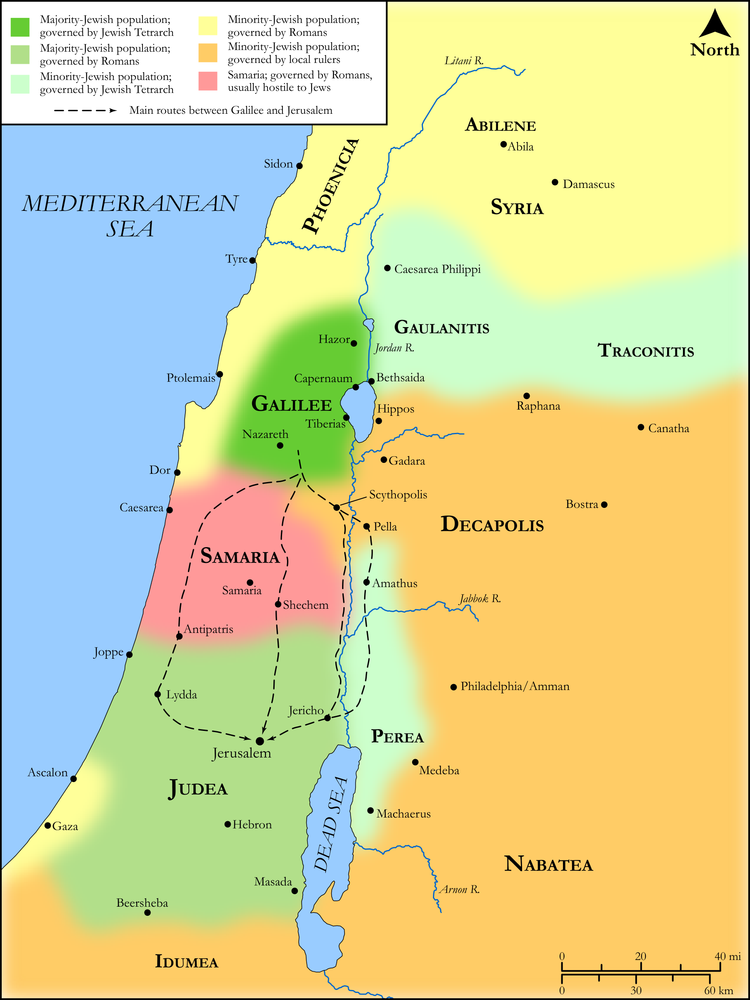

# Biblica Open Bible Maps

## License Information

Biblica Open Bible Maps, © 2023–2025 Biblica, Inc. This work is licensed under Creative Commons Attribution-ShareAlike 4.0 International (<a href="https://creativecommons.org/licenses/by-sa/4.0/">https://creativecommons.org/licenses/by-sa/4.0/</a>). More Information: <a href="https://docs.google.com/document/d/1Pp44yZ0Zdnd59vJHTrt2rPYq0SppfX5rZbPBt6mz37U/edit?tab=t.0#heading=h.oev9aj1ksvk2">https://docs.google.com/document/d/1Pp44yZ0Zdnd59vJHTrt2rPYq0SppfX5rZbPBt6mz37U/edit?tab=t.0#heading=h.oev9aj1ksvk2</a>

--------------------------------

## The Life of Jesus: Routes from Galilee to Jerusalem (id: NT004)

### Image Content

[link](images/NT004.png)

Original: [The Life of Jesus: Routes from Galilee to Jerusalem](https://drive.google.com/open?id=1Un6I1zGPi53muK2vAeNMdIUSG7tIF0f2&usp=drive_copy)

