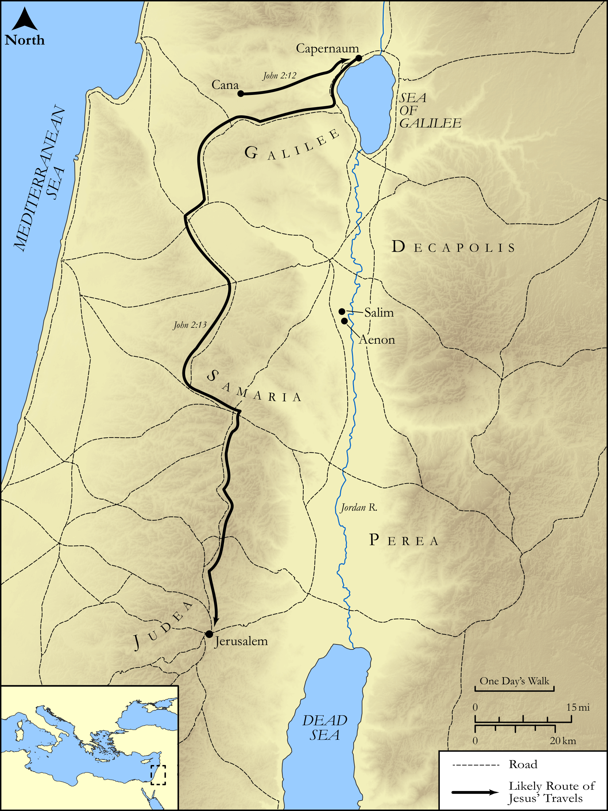

# Biblica Open Bible Maps

## License Information

Biblica Open Bible Maps, © 2023–2025 Biblica, Inc. This work is licensed under Creative Commons Attribution-ShareAlike 4.0 International (<a href="https://creativecommons.org/licenses/by-sa/4.0/">https://creativecommons.org/licenses/by-sa/4.0/</a>). More Information: <a href="https://docs.google.com/document/d/1Pp44yZ0Zdnd59vJHTrt2rPYq0SppfX5rZbPBt6mz37U/edit?tab=t.0#heading=h.oev9aj1ksvk2">https://docs.google.com/document/d/1Pp44yZ0Zdnd59vJHTrt2rPYq0SppfX5rZbPBt6mz37U/edit?tab=t.0#heading=h.oev9aj1ksvk2</a>

--------------------------------

## The Life of Jesus: Jesus' First Journey from Galilee to Jerusalem (id: NT012)

### Image Content

[link](images/NT012.png)

Original: [The Life of Jesus: Jesus' First Journey from Galilee to Jerusalem](https://drive.google.com/open?id=1ngX2hcH8Is6LJ9fEliI7k1qYE9buDlH_&usp=drive_copy)

* **Associated Passages:** John 2:1-3:36

* **Associated ACAI Concepts:** Jesus (ID: `person:Jesus.2`); LORD (ID: `deity:Lord`); Believe (ID: `keyterm:Believe`); Jews (ID: `group:Jews`); Be a Disciple (ID: `keyterm:Disciple`); Bear Witness (ID: `keyterm:BearWitness`); John (ID: `person:John`); Temple (ID: `realia:Temple`); Symbol (ID: `keyterm:Example`); Holy Spirit (ID: `deity:HolySpirit`); Surely! (ID: `keyterm:Surely`); Sky (ID: `keyterm:Heaven`); Always (ID: `keyterm:Always`); Love (ID: `keyterm:Love`); Nicodemus (ID: `person:Nicodemus`); Ability (ID: `keyterm:Ability`); Name (ID: `keyterm:Name`); Life (ID: `keyterm:Life`); Baptism (ID: `keyterm:Baptism`); Cana (ID: `place:Cana`); Decided (ID: `keyterm:Decided`); Kingdom (ID: `keyterm:Kingdom`); Jerusalem (ID: `place:Jerusalem`); To Cleanse (ID: `keyterm:Cleanse.2`); Body (ID: `keyterm:Body.3`); Passover (ID: `keyterm:Passover`); Galilee (ID: `place:Galilee`); Wine (ID: `realia:Wine`); Stone Jar (ID: `realia:StoneJar`); Judeans (ID: `group:Judea`)
