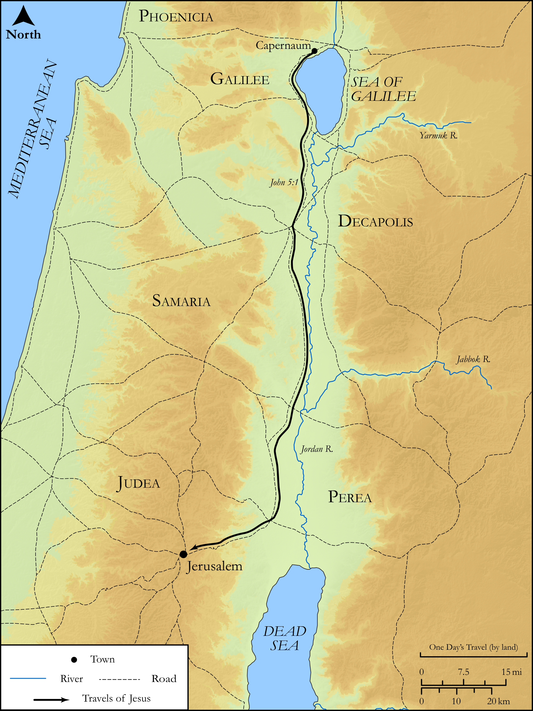

# Biblica Open Bible Maps

## License Information

Biblica Open Bible Maps, © 2023–2025 Biblica, Inc. This work is licensed under Creative Commons Attribution-ShareAlike 4.0 International (https://creativecommons.org/licenses/by-sa/4.0/). More Information: https://docs.google.com/document/d/1Pp44yZ0Zdnd59vJHTrt2rPYq0SppfX5rZbPBt6mz37U/edit?tab=t.0#heading=h.oev9aj1ksvk2

--------------------------------

## The Life of Jesus: Jesus' Second Journey from Galilee to Jerusalem (id: NT014)

### Image Content

[link](images/NT014.png)

Original: [The Life of Jesus: Jesus' Second Journey from Galilee to Jerusalem](https://drive.google.com/open?id=1kMErSVZXljYPcvLMhPJb5WOALgVIEzs1&usp=drive_copy)

* **Associated Passages:** John 5:1-47

* **Associated ACAI Concepts:** LORD (ID: `deity:Lord`); Jesus (ID: `person:Jesus.2`); Bear Witness (ID: `keyterm:BearWitness`); Life (ID: `keyterm:Life`); Believe (ID: `keyterm:Believe`); Jews (ID: `group:Jews`); Judgment (ID: `keyterm:Judgment`); Court Case (ID: `keyterm:CourtCase`); Sabbath (ID: `keyterm:Sabbath`); Bed (ID: `realia:Bed`); Surely! (ID: `keyterm:Surely`); Moses (ID: `person:Moses`); Jerusalem (ID: `place:Jerusalem`); Glory (ID: `keyterm:Glory`); Resurrection (ID: `keyterm:Resurrection`); John (ID: `person:John`); Decided (ID: `keyterm:Decided`); True (ID: `keyterm:True`); Always (ID: `keyterm:Always`); Bethesda (ID: `place:Bethesda`); Make Alive (ID: `keyterm:Alive`); Letter (ID: `keyterm:Letter`); Be (Or Show Oneself) Just (ID: `keyterm:Just`); Written (ID: `keyterm:Scripture`); Sheep Gate (ID: `place:SheepGate`); Pool (ID: `realia:Pool`); Love (ID: `keyterm:Love`); Ask for (ID: `keyterm:AskFor`); Truth (ID: `keyterm:Truth`); Salvation (ID: `keyterm:Salvation`); To Sin (ID: `keyterm:Sin`); Hope (ID: `keyterm:Hope`); Word (ID: `keyterm:Word`); Good (ID: `keyterm:Good`); Friendship (ID: `keyterm:Friendship`); Name (ID: `keyterm:Name`); Be Lawful (ID: `keyterm:Lawful`); Ability (ID: `keyterm:Ability`); Serve (ID: `keyterm:Serve`); Authority (ID: `keyterm:Authority.2`); Porch (ID: `realia:Porch`); Grave (ID: `realia:Grave`); Temple (ID: `realia:Temple`)
