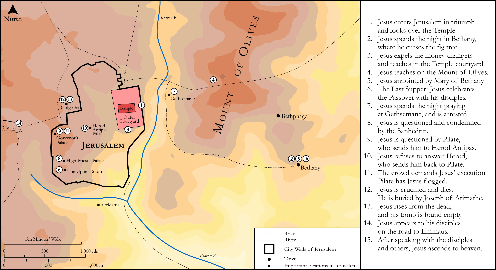

# Biblica Open Bible Maps

## License Information

Biblica Open Bible Maps, © 2023–2025 Biblica, Inc. This work is licensed under Creative Commons Attribution-ShareAlike 4.0 International (https://creativecommons.org/licenses/by-sa/4.0/). More Information: https://docs.google.com/document/d/1Pp44yZ0Zdnd59vJHTrt2rPYq0SppfX5rZbPBt6mz37U/edit?tab=t.0#heading=h.oev9aj1ksvk2

--------------------------------

## The Life of Jesus: The Last Week of Jesus' Life (Map Only) (id: NT020)

### Image Content

[link](images/NT020.png)

Original: [The Life of Jesus: The Last Week of Jesus' Life (Map Only)](https://drive.google.com/open?id=1DC2yDctyVr238ApUBBsCUeDcEsse_WHG&usp=drive_copy)

* **Associated Passages:** Matthew 21:1-28:20; Mark 11:1-16:20; Luke 19:1-24:53; John 12:1-21:25

* **Associated ACAI Concepts:** Jesus (ID: `person:Jesus.2`); LORD (ID: `deity:Lord`); Be a Disciple (ID: `keyterm:Disciple`); Ability (ID: `keyterm:Ability`); Peter (ID: `person:Peter`); Pilate (ID: `person:Pilate`); Believe (ID: `keyterm:Believe`); Name (ID: `keyterm:Name`); Jews (ID: `group:Jews`); Sky (ID: `keyterm:Heaven`); Surely! (ID: `keyterm:Surely`); Love (ID: `keyterm:Love`); Resurrection (ID: `keyterm:Resurrection`); Kingdom (ID: `keyterm:Kingdom`); Jerusalem (ID: `place:Jerusalem`); Glory (ID: `keyterm:Glory`); Pray (ID: `keyterm:Pray`); Body (ID: `keyterm:Body.3`); Ask for (ID: `keyterm:AskFor`); Fear (ID: `keyterm:Fear`); Authority (ID: `keyterm:Authority.2`); Galilee (ID: `place:Galilee`); Passover (ID: `keyterm:Passover`); Life (ID: `keyterm:Life`); Heart (ID: `keyterm:Heart`); Written (ID: `keyterm:Scripture`); Salvation (ID: `keyterm:Salvation`); Judas (ID: `person:Judas.2`); Pharisees (ID: `group:Pharisee`); To Cause to Happen (ID: `keyterm:Happen`)
