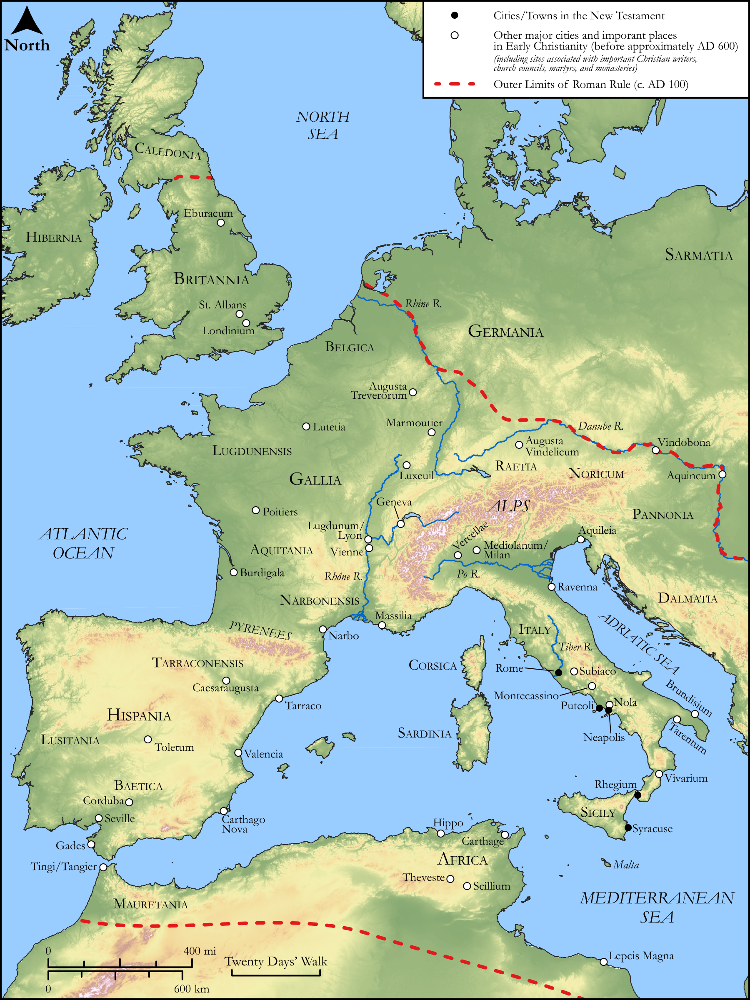

# Biblica Open Bible Maps

## License Information

Biblica Open Bible Maps, © 2023–2025 Biblica, Inc. This work is licensed under Creative Commons Attribution-ShareAlike 4.0 International (https://creativecommons.org/licenses/by-sa/4.0/). More Information: https://docs.google.com/document/d/1Pp44yZ0Zdnd59vJHTrt2rPYq0SppfX5rZbPBt6mz37U/edit?tab=t.0#heading=h.oev9aj1ksvk2

--------------------------------

## Paul and the Early Church: Important Sites in Early Christianity (West) (id: NT023)

### Image Content

[link](images/NT023.png)

Original: [Paul and the Early Church: Important Sites in Early Christianity (West)](https://drive.google.com/open?id=1H7-S6RUqEP9SdNO6oU-ix3iZYe18f1Sq&usp=drive_copy)

