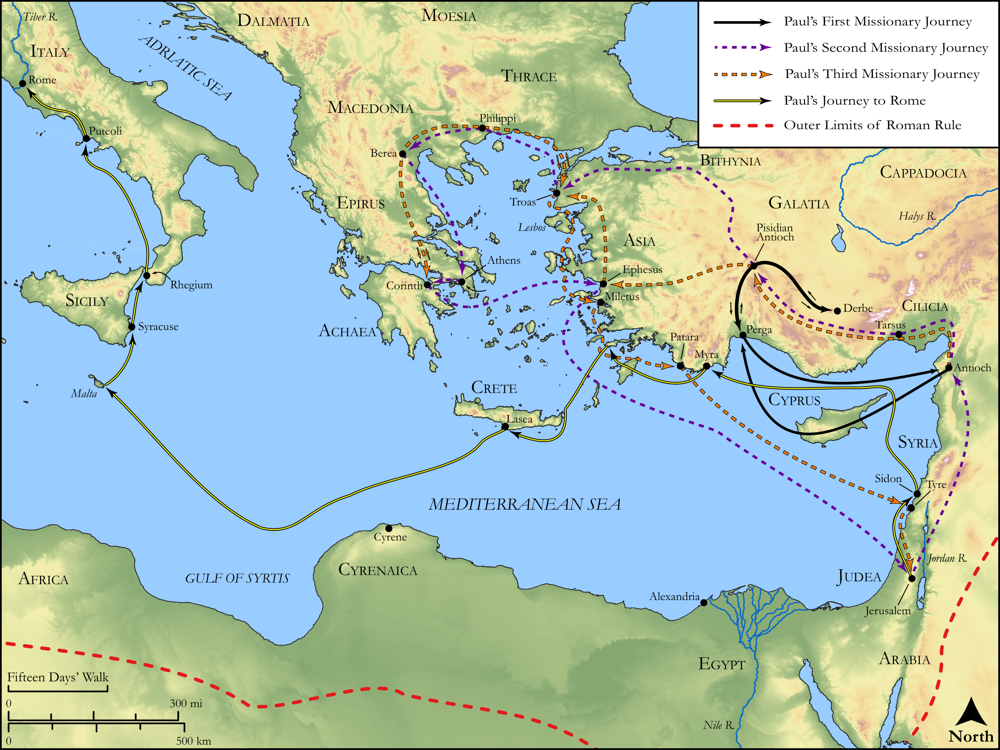

# Biblica Open Bible Maps

## License Information

Biblica Open Bible Maps, © 2023–2025 Biblica, Inc. This work is licensed under Creative Commons Attribution-ShareAlike 4.0 International (https://creativecommons.org/licenses/by-sa/4.0/). More Information: https://docs.google.com/document/d/1Pp44yZ0Zdnd59vJHTrt2rPYq0SppfX5rZbPBt6mz37U/edit?tab=t.0#heading=h.oev9aj1ksvk2

--------------------------------

## Paul and the Early Church: Overview of Paul's Journeys (id: NT024)

### Image Content

[link](images/NT024.png)

Original: [Paul and the Early Church: Overview of Paul's Journeys](https://drive.google.com/open?id=13i7Sp_fji5qcQPGPURsE0UG4PU-ENk2u&usp=drive_copy)

* **Associated Passages:** Acts 13:1-28:31

* **Associated ACAI Concepts:** Paul (ID: `person:Paul`); LORD (ID: `deity:Lord`); Jews (ID: `group:Jews`); Jesus (ID: `person:Jesus.2`); Believe (ID: `keyterm:Believe`); Jerusalem (ID: `place:Jerusalem`); Name (ID: `keyterm:Name`); Gentiles (ID: `group:Gentile`); Ask for (ID: `keyterm:AskFor`); Decided (ID: `keyterm:Decided`); Barnabas (ID: `person:Barnabas`); Rome (ID: `place:Rome`); Salvation (ID: `keyterm:Salvation`); Holy Spirit (ID: `deity:HolySpirit`); Life (ID: `keyterm:Life`); Be a Disciple (ID: `keyterm:Disciple`); Law (ID: `keyterm:Law`); Festus (ID: `person:Festus`); Persuade (ID: `keyterm:Persuade`); Silas (ID: `person:Silas`); Ephesus (ID: `place:Ephesus`); Asia (ID: `place:Asia`); Agrippa (ID: `person:Agrippa`); Macedonia (ID: `place:Macedonia`); Favor (ID: `keyterm:Favor`); Serve (ID: `keyterm:Serve`); Church (ID: `keyterm:Church`); Claudius (ID: `person:Claudius`); Greeks (ID: `group:Greek`); Worship (ID: `keyterm:Worship`)
