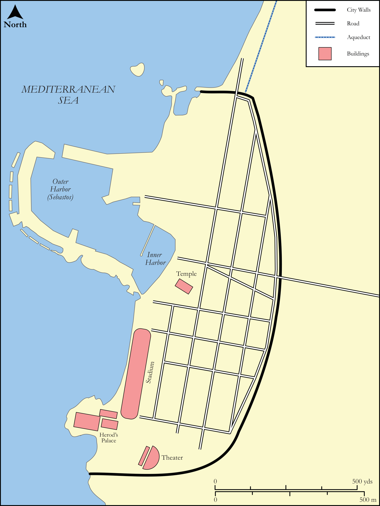

# Biblica Open Bible Maps

## License Information

Biblica Open Bible Maps, © 2023–2025 Biblica, Inc. This work is licensed under Creative Commons Attribution-ShareAlike 4.0 International (https://creativecommons.org/licenses/by-sa/4.0/). More Information: https://docs.google.com/document/d/1Pp44yZ0Zdnd59vJHTrt2rPYq0SppfX5rZbPBt6mz37U/edit?tab=t.0#heading=h.oev9aj1ksvk2

--------------------------------

## Paul and the Early Church: City Plan: Caesarea in the Time of Paul (id: NT029)

### Image Content

[link](images/NT029.png)

Original: [Paul and the Early Church: City Plan: Caesarea in the Time of Paul](https://drive.google.com/open?id=1R8Ap6K_VkIMLJXhT9hD22Y3VyQMaE4EU&usp=drive_copy)

