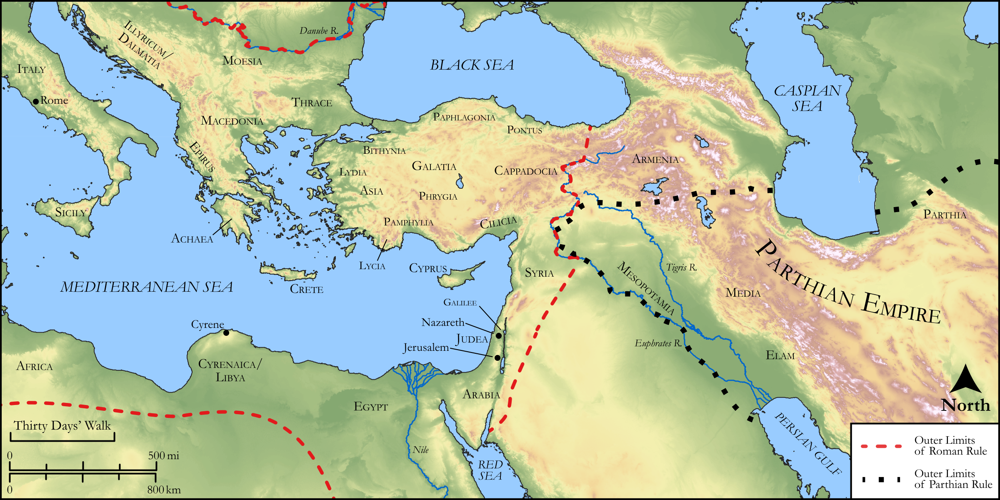

# Biblica Open Bible Maps

## License Information

Biblica Open Bible Maps, © 2023–2025 Biblica, Inc. This work is licensed under Creative Commons Attribution-ShareAlike 4.0 International (<a href="https://creativecommons.org/licenses/by-sa/4.0/">https://creativecommons.org/licenses/by-sa/4.0/</a>). More Information: <a href="https://docs.google.com/document/d/1Pp44yZ0Zdnd59vJHTrt2rPYq0SppfX5rZbPBt6mz37U/edit?tab=t.0#heading=h.oev9aj1ksvk2">https://docs.google.com/document/d/1Pp44yZ0Zdnd59vJHTrt2rPYq0SppfX5rZbPBt6mz37U/edit?tab=t.0#heading=h.oev9aj1ksvk2</a>

--------------------------------

## Paul and the Early Church: The Gathering at Pentecost (id: NT031)

### Image Content

[link](images/NT031.png)

Original: [Paul and the Early Church: The Gathering at Pentecost](https://drive.google.com/open?id=1wbgP_YnWouDrJqtRON5KrOjDLnJrKy3z&usp=drive_copy)

* **Associated Passages:** Acts 2:1-47

* **Associated ACAI Concepts:** LORD (ID: `deity:Lord`); Jesus (ID: `person:Jesus.2`); Holy Spirit (ID: `deity:HolySpirit`); Sky (ID: `keyterm:Heaven`); Portent (ID: `keyterm:Portent`); Peter (ID: `person:Peter`); Salvation (ID: `keyterm:Salvation`); Heart (ID: `keyterm:Heart`); David (ID: `person:David`); Symbol (ID: `keyterm:Example`); Body (ID: `keyterm:Body.3`); Jerusalem (ID: `place:Jerusalem`); Baptism (ID: `keyterm:Baptism`); World of the Dead (ID: `keyterm:WorldOfTheDead`); Promise (ID: `keyterm:Promise`); Judea (ID: `place:Judea`); Speak as a Prophet (ID: `keyterm:Speak`); Hell (ID: `place:Hell`); Blood (ID: `keyterm:Blood`); Name (ID: `keyterm:Name`); Jews (ID: `group:Jews`); Israel (ID: `person:Israel`); Phrygia (ID: `place:Phrygia`); Call Upon (ID: `keyterm:CallUpon`); Joel (ID: `person:Joel.14`); Word (ID: `keyterm:Word`); Cretans (ID: `group:Cretan`); Elamites (ID: `group:Elam`); Parthians (ID: `group:Parthians`); Repent (ID: `keyterm:Repent`); Galileans (ID: `group:Galilee`); Medan (ID: `person:Medan`); Resurrection (ID: `keyterm:Resurrection`); Cyrene (ID: `place:Cyrene`); Fellowship (ID: `keyterm:Fellowship`); Elam (ID: `place:Elam`); Libya (ID: `place:Libya`); Cappadocia (ID: `place:Cappadocia`); Pontus (ID: `place:Pontus`); Judeans (ID: `group:Judea`); Arabians (ID: `group:Arabia`); Favor (ID: `keyterm:Favor`); Crete (ID: `place:Crete`); Mesopotamia (ID: `place:Mesopotamia`); Medes (ID: `group:Mede`); Pray (ID: `keyterm:Pray`); Be Lawful (ID: `keyterm:Lawful`); Galilee (ID: `place:Galilee`); Ability (ID: `keyterm:Ability`); Asia (ID: `place:Asia`); Holy (ID: `keyterm:Holy`); Ask for (ID: `keyterm:AskFor`); Rome (ID: `place:Rome`); Israelites (ID: `group:Israel`); Nazareth (ID: `place:Nazareth`); Hope (ID: `keyterm:Hope`); To Sin (ID: `keyterm:Sin`); Life (ID: `keyterm:Life`); Pamphylia (ID: `place:Pamphylia`); Arabia (ID: `place:Arabia`); In Common (ID: `keyterm:InCommon`); Witness (ID: `keyterm:Witness`); Egypt (ID: `place:Egypt`); Lawless (ID: `keyterm:Lawless`); Fear (ID: `keyterm:Fear`); Something Definite (ID: `keyterm:SomethingDefinite`); Mighty Act (ID: `keyterm:MightyAct`); Forgive (ID: `keyterm:Forgive`); Oath (ID: `keyterm:Oath`); Declare (ID: `keyterm:Declare`); Believe (ID: `keyterm:Believe`); Cross (ID: `realia:Cross`); Temple (ID: `realia:Temple`); House (ID: `realia:House`); Sweet Wine (ID: `realia:SweetWine`); Grave (ID: `realia:Grave`); Throne (ID: `realia:Throne`); Footstool (ID: `realia:Footstool`)
