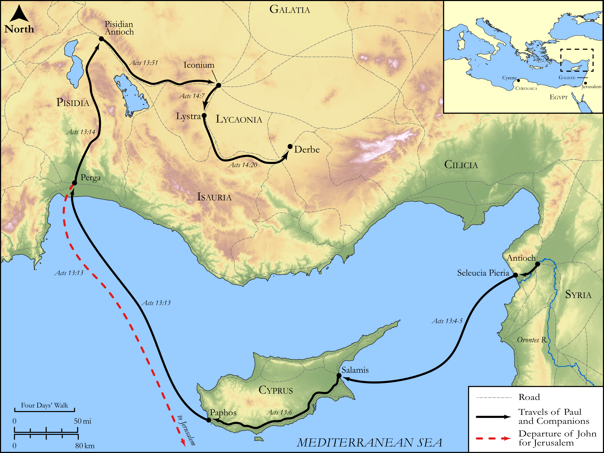

# Biblica Open Bible Maps

## License Information

Biblica Open Bible Maps, © 2023–2025 Biblica, Inc. This work is licensed under Creative Commons Attribution-ShareAlike 4.0 International (https://creativecommons.org/licenses/by-sa/4.0/). More Information: https://docs.google.com/document/d/1Pp44yZ0Zdnd59vJHTrt2rPYq0SppfX5rZbPBt6mz37U/edit?tab=t.0#heading=h.oev9aj1ksvk2

--------------------------------

## Paul and the Early Church: Paul's First Missionary Journey (Part 1) (id: NT039)

### Image Content

[link](images/NT039.png)

Original: [Paul and the Early Church: Paul's First Missionary Journey (Part 1\)](https://drive.google.com/open?id=1cTTRdAVIGC9ejf4ejWwaZow7zX7dYXDN&usp=drive_copy)

* **Associated Passages:** Acts 13:1-52

* **Associated ACAI Concepts:** LORD (ID: `deity:Lord`); Paul (ID: `person:Paul`); Barnabas (ID: `person:Barnabas`); Jews (ID: `group:Jews`); Believe (ID: `keyterm:Believe`); Holy Spirit (ID: `deity:HolySpirit`); Sabbath (ID: `keyterm:Sabbath`); Israel (ID: `person:Israel`); David (ID: `person:David`); Jerusalem (ID: `place:Jerusalem`); Gentiles (ID: `group:Gentile`); Paphos (ID: `place:Paphos`); Bar-jesus (ID: `person:Bar-jesus`); Worship (ID: `keyterm:Worship`); Abstain from Food (ID: `keyterm:Fast`); Perga (ID: `place:Perga`); Synagogue (ID: `realia:Synagogue`); Ask for (ID: `keyterm:AskFor`); Jesus (ID: `person:Jesus.2`); Resurrection (ID: `keyterm:Resurrection`); Promise (ID: `keyterm:Promise`); Decided (ID: `keyterm:Decided`); Mark (ID: `person:Mark`); Salvation (ID: `keyterm:Salvation`); John (ID: `person:John`); Name (ID: `keyterm:Name`); Always (ID: `keyterm:Always`); Life (ID: `keyterm:Life`); Law (ID: `keyterm:Law`); Holy (ID: `keyterm:Holy`)
