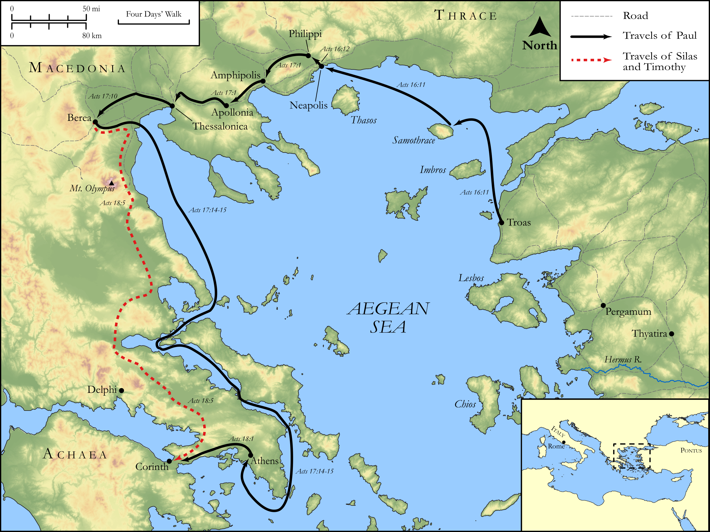

# Biblica Open Bible Maps

## License Information

Biblica Open Bible Maps, © 2023–2025 Biblica, Inc. This work is licensed under Creative Commons Attribution-ShareAlike 4.0 International (https://creativecommons.org/licenses/by-sa/4.0/). More Information: https://docs.google.com/document/d/1Pp44yZ0Zdnd59vJHTrt2rPYq0SppfX5rZbPBt6mz37U/edit?tab=t.0#heading=h.oev9aj1ksvk2

--------------------------------

## Paul and the Early Church: Paul's Second Missionary Journey (Part 3) (id: NT043)

### Image Content

[link](images/NT043.png)

Original: [Paul and the Early Church: Paul's Second Missionary Journey (Part 3\)](https://drive.google.com/open?id=12I7Kd4WRpLQ4bOQpQq_FMqjG28nfVREI&usp=drive_copy)

* **Associated Passages:** Acts 16:1-18:28

* **Associated ACAI Concepts:** Paul (ID: `person:Paul`); LORD (ID: `deity:Lord`); Jews (ID: `group:Jews`); Jesus (ID: `person:Jesus.2`); Silas (ID: `person:Silas`); Name (ID: `keyterm:Name`); Believe (ID: `keyterm:Believe`); Worship (ID: `keyterm:Worship`); Greeks (ID: `group:Greek`); Athens (ID: `place:Athens`); Rome (ID: `place:Rome`); Ask for (ID: `keyterm:AskFor`); Javan (ID: `person:Javan`); Synagogue (ID: `realia:Synagogue`); Jason (ID: `person:Jason`); Macedonia (ID: `place:Macedonia`); Timothy (ID: `person:Timothy`); Written (ID: `keyterm:Scripture`); Baptism (ID: `keyterm:Baptism`); Prison (ID: `realia:Prison`); Gallio (ID: `person:Gallio`); Thessalonica (ID: `place:Thessalonica`); Aquila (ID: `person:Aquila`); Areopagus (ID: `place:Areopagus`); Decided (ID: `keyterm:Decided`); Priscilla (ID: `person:Priscilla`); Pray (ID: `keyterm:Pray`); Salvation (ID: `keyterm:Salvation`); Ability (ID: `keyterm:Ability`); Sabbath (ID: `keyterm:Sabbath`)
