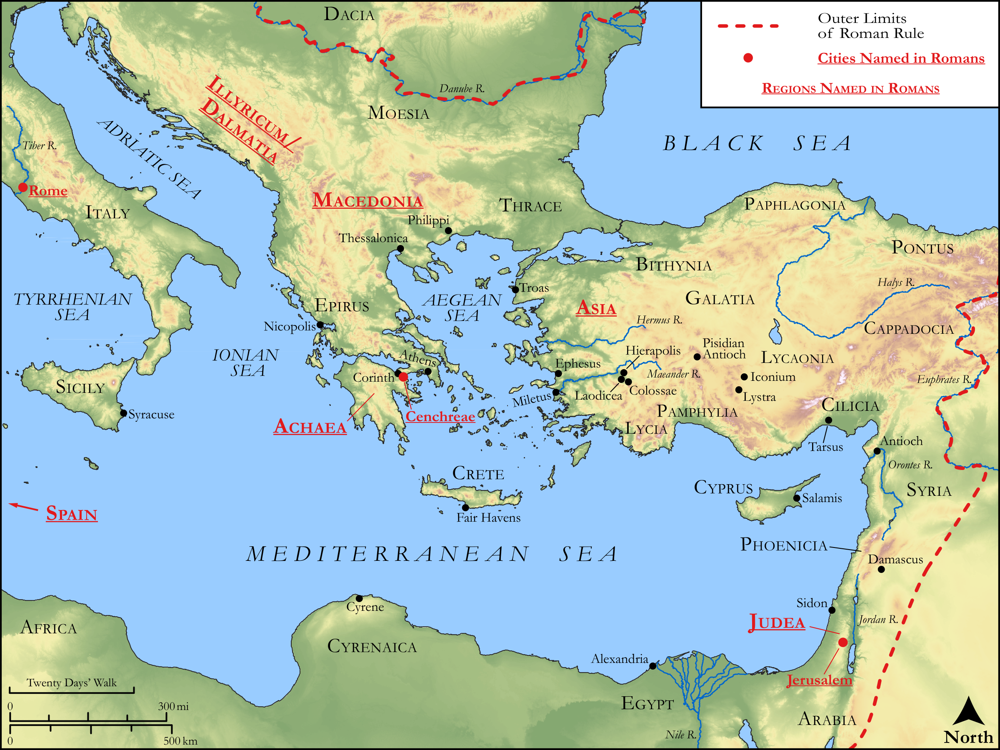

# Biblica Open Bible Maps

## License Information

Biblica Open Bible Maps, © 2023–2025 Biblica, Inc. This work is licensed under Creative Commons Attribution-ShareAlike 4.0 International (https://creativecommons.org/licenses/by-sa/4.0/). More Information: https://docs.google.com/document/d/1Pp44yZ0Zdnd59vJHTrt2rPYq0SppfX5rZbPBt6mz37U/edit?tab=t.0#heading=h.oev9aj1ksvk2

--------------------------------

## Paul and the Early Church: Romans (id: NT051)

### Image Content

[link](images/NT051.png)

Original: [Paul and the Early Church: Romans](https://drive.google.com/open?id=16k06rjit2-or0vTMbyBVtDiKhB5SscAa&usp=drive_copy)

* **Associated Passages:** Romans 1:1-16:27

* **Associated ACAI Concepts:** LORD (ID: `deity:Lord`); Jesus (ID: `person:Jesus.2`); Law (ID: `keyterm:Law`); Believe (ID: `keyterm:Believe`); To Sin (ID: `keyterm:Sin`); Be (Or Show Oneself) Just (ID: `keyterm:Just`); Body (ID: `keyterm:Body.3`); Life (ID: `keyterm:Life`); Favor (ID: `keyterm:Favor`); Ability (ID: `keyterm:Ability`); Holy Spirit (ID: `deity:HolySpirit`); Good (ID: `keyterm:Good`); Heart (ID: `keyterm:Heart`); Glory (ID: `keyterm:Glory`); Gentiles (ID: `group:Gentile`); Decided (ID: `keyterm:Decided`); Love (ID: `keyterm:Love`); Holy (ID: `keyterm:Holy`); In Christ (ID: `keyterm:InChrist`); Salvation (ID: `keyterm:Salvation`); Hope (ID: `keyterm:Hope`); Israel (ID: `person:Israel`); Circumcision (ID: `keyterm:Circumcision`); Good News (ID: `keyterm:GoodNews`); Jews (ID: `group:Jews`); Promise (ID: `keyterm:Promise`); Mercy (ID: `keyterm:Mercy`); Resurrection (ID: `keyterm:Resurrection`); Make Peace (ID: `keyterm:Peace`); Abraham (ID: `person:Abraham`)
