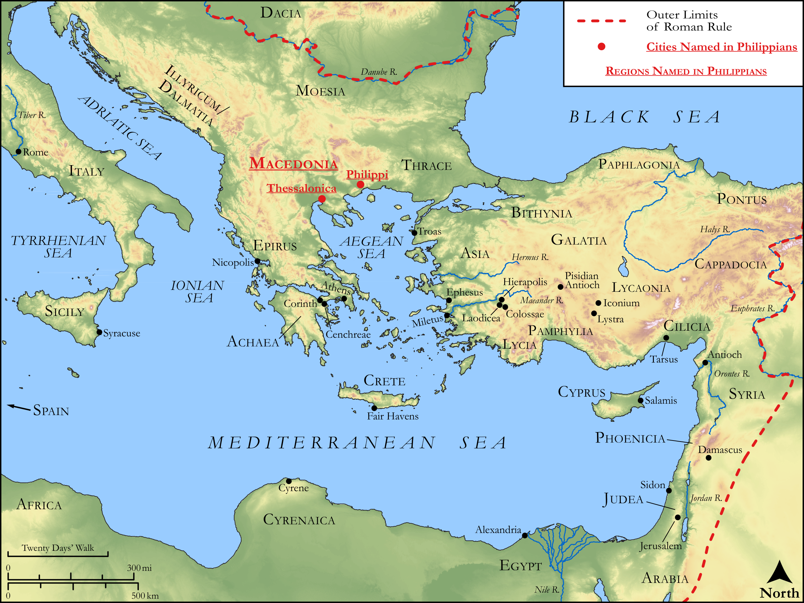

# Biblica Open Bible Maps

## License Information

Biblica Open Bible Maps, © 2023–2025 Biblica, Inc. This work is licensed under Creative Commons Attribution-ShareAlike 4.0 International (https://creativecommons.org/licenses/by-sa/4.0/). More Information: https://docs.google.com/document/d/1Pp44yZ0Zdnd59vJHTrt2rPYq0SppfX5rZbPBt6mz37U/edit?tab=t.0#heading=h.oev9aj1ksvk2

--------------------------------

## Paul and the Early Church: Philippians (id: NT054)

### Image Content

[link](images/NT054.png)

Original: [Paul and the Early Church: Philippians](https://drive.google.com/open?id=1LOG1NGkcEO-Qor_BI35HFckT_vhMW_mt&usp=drive_copy)

* **Associated Passages:** Philippians 1:1-4:23

* **Associated ACAI Concepts:** Jesus (ID: `person:Jesus.2`); LORD (ID: `deity:Lord`); In Christ (ID: `keyterm:InChrist`); Good News (ID: `keyterm:GoodNews`); Heart (ID: `keyterm:Heart`); Think (ID: `keyterm:Think`); Body (ID: `keyterm:Body.3`); Life (ID: `keyterm:Life`); Glory (ID: `keyterm:Glory`); Persuade (ID: `keyterm:Persuade`); Cause of Joy (ID: `keyterm:CauseOfJoy`); Be (Or Show Oneself) Just (ID: `keyterm:Just`); Believe (ID: `keyterm:Believe`); Pray (ID: `keyterm:Pray`); Love (ID: `keyterm:Love`); Ask for (ID: `keyterm:AskFor`); Favor (ID: `keyterm:Favor`); Fellowship (ID: `keyterm:Fellowship`); Salvation (ID: `keyterm:Salvation`); Live (ID: `keyterm:Live.3`); Name (ID: `keyterm:Name`); Make Peace (ID: `keyterm:Peace`); Holy Spirit (ID: `deity:HolySpirit`); Law (ID: `keyterm:Law`); Holy (ID: `keyterm:Holy`); Hope (ID: `keyterm:Hope`); Priesthood (ID: `keyterm:Priesthood`); Spirit (ID: `keyterm:Spirit.2`); Pure (ID: `keyterm:Pure`); Epaphroditus (ID: `person:Epaphroditus`)
