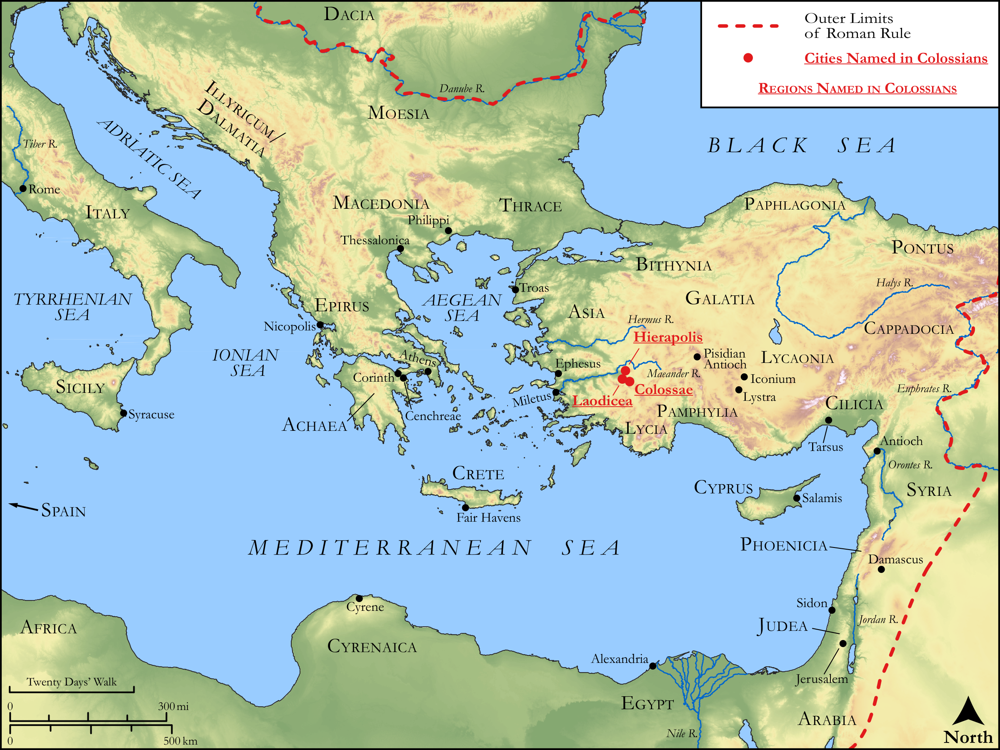

# Biblica Open Bible Maps

## License Information

Biblica Open Bible Maps, © 2023–2025 Biblica, Inc. This work is licensed under Creative Commons Attribution-ShareAlike 4.0 International (<a href="https://creativecommons.org/licenses/by-sa/4.0/">https://creativecommons.org/licenses/by-sa/4.0/</a>). More Information: <a href="https://docs.google.com/document/d/1Pp44yZ0Zdnd59vJHTrt2rPYq0SppfX5rZbPBt6mz37U/edit?tab=t.0#heading=h.oev9aj1ksvk2">https://docs.google.com/document/d/1Pp44yZ0Zdnd59vJHTrt2rPYq0SppfX5rZbPBt6mz37U/edit?tab=t.0#heading=h.oev9aj1ksvk2</a>

--------------------------------

## Paul and the Early Church: Colossians (id: NT055)

### Image Content

[link](images/NT055.png)

Original: [Paul and the Early Church: Colossians](https://drive.google.com/open?id=1ZcK9e0Igcp6cpYCCB7nwhnZZvQbpfZDB&usp=drive_copy)

* **Associated Passages:** Colossians 1:1-4:18

* **Associated ACAI Concepts:** Jesus (ID: `person:Jesus.2`); LORD (ID: `deity:Lord`); Body (ID: `keyterm:Body.3`); Ability (ID: `keyterm:Ability`); Love (ID: `keyterm:Love`); Holy (ID: `keyterm:Holy`); Favor (ID: `keyterm:Favor`); Sky (ID: `keyterm:Heaven`); Pray (ID: `keyterm:Pray`); Heart (ID: `keyterm:Heart`); Believe (ID: `keyterm:Believe`); Live (ID: `keyterm:Live.3`); Church (ID: `keyterm:Church`); Beloved (ID: `keyterm:Beloved`); Laodicea (ID: `place:Laodicea`); Faithfulness (ID: `keyterm:Faithfulness`); Life (ID: `keyterm:Life`); Authority (ID: `keyterm:Authority.2`); Make Peace (ID: `keyterm:Peace`); Hope (ID: `keyterm:Hope`); Forgive (ID: `keyterm:Forgive`); Circumcision (ID: `keyterm:Circumcision`); In Christ (ID: `keyterm:InChrist`); Paul (ID: `person:Paul`); Epaphras (ID: `person:Epaphras`); Fundamental Principles (ID: `keyterm:FundamentalPrinciples`); Glory (ID: `keyterm:Glory`); Ask for (ID: `keyterm:AskFor`); Proclaim (ID: `keyterm:Proclaim`); Good News (ID: `keyterm:GoodNews`)
