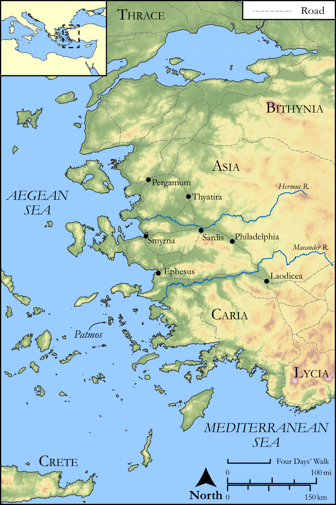

# Biblica Open Bible Maps

## License Information

Biblica Open Bible Maps, © 2023–2025 Biblica, Inc. This work is licensed under Creative Commons Attribution-ShareAlike 4.0 International (<a href="https://creativecommons.org/licenses/by-sa/4.0/">https://creativecommons.org/licenses/by-sa/4.0/</a>). More Information: <a href="https://docs.google.com/document/d/1Pp44yZ0Zdnd59vJHTrt2rPYq0SppfX5rZbPBt6mz37U/edit?tab=t.0#heading=h.oev9aj1ksvk2">https://docs.google.com/document/d/1Pp44yZ0Zdnd59vJHTrt2rPYq0SppfX5rZbPBt6mz37U/edit?tab=t.0#heading=h.oev9aj1ksvk2</a>

--------------------------------

## Paul and the Early Church: Revelation (id: NT060)

### Image Content

[link](images/NT060.png)

Original: [Paul and the Early Church: Revelation](https://drive.google.com/open?id=1os-fhAZVMhGtwBvb_c60ik7F5wP596Ia&usp=drive_copy)

* **Associated Passages:** Revelation 1:1-22:21

* **Associated ACAI Concepts:** LORD (ID: `deity:Lord`); An Angel (ID: `deity:Angel`); Sky (ID: `keyterm:Heaven`); Ability (ID: `keyterm:Ability`); Name (ID: `keyterm:Name`); Life (ID: `keyterm:Life`); Holy (ID: `keyterm:Holy`); Bow Down (ID: `keyterm:BowDown`); Glory (ID: `keyterm:Glory`); Authority (ID: `keyterm:Authority.2`); Jesus (ID: `person:Jesus.2`); Church (ID: `keyterm:Church`); Blood (ID: `keyterm:Blood`); Always (ID: `keyterm:Always`); Holy Spirit (ID: `deity:HolySpirit`); Bear Witness (ID: `keyterm:BearWitness`); Fornication (ID: `keyterm:Fornication`); A Disembodied Voice (ID: `deity:Voice`); True (ID: `keyterm:True`); Repent (ID: `keyterm:Repent`); Kingdom (ID: `keyterm:Kingdom`); To Act Wickedly (ID: `keyterm:ActWickedly`); Decided (ID: `keyterm:Decided`); Fear (ID: `keyterm:Fear`); Abyss (ID: `keyterm:Abyss`); Spirit (ID: `keyterm:Spirit.2`); Blaspheme (ID: `keyterm:Blaspheme`); Faithfulness (ID: `keyterm:Faithfulness`); Disaster (ID: `keyterm:Disaster`); Happy (ID: `keyterm:Happy`)
