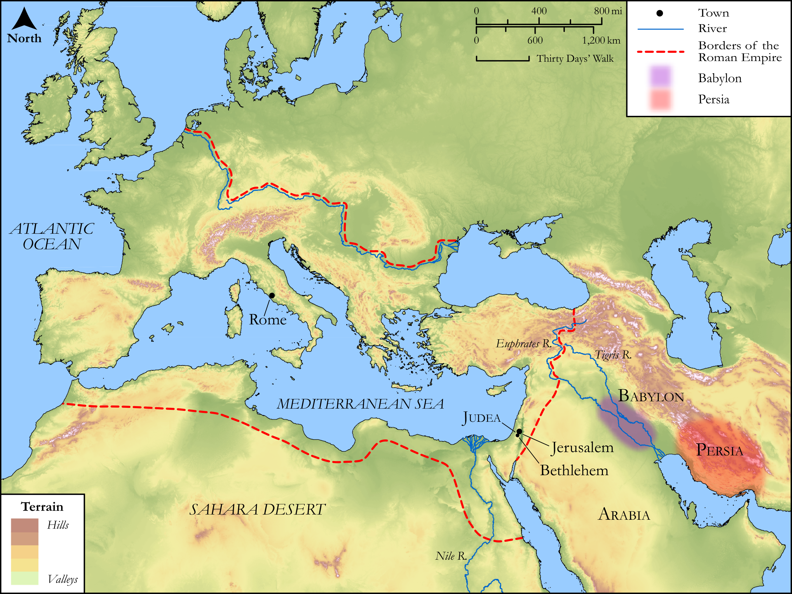

# Biblica Open Bible Maps

## License Information

Biblica Open Bible Maps, © 2023–2025 Biblica, Inc. This work is licensed under Creative Commons Attribution-ShareAlike 4.0 International (https://creativecommons.org/licenses/by-sa/4.0/). More Information: https://docs.google.com/document/d/1Pp44yZ0Zdnd59vJHTrt2rPYq0SppfX5rZbPBt6mz37U/edit?tab=t.0#heading=h.oev9aj1ksvk2

--------------------------------

## SRV Matthew: Matt. 2:1–11 (id: NT100)

### Image Content

[link](images/NT100.png)

Original: [SRV Matthew: Matt. 2:1\-11](https://drive.google.com/open?id=1dFvzTG0Mx3YOhFyrzBtqfVXdUebKmnrt&usp=drive_copy)

* **Associated Passages:** Matthew 2:1-23

* **Associated ACAI Concepts:** Herod (ID: `person:Herod`); Bethlehem (ID: `place:Bethlehem`); Egypt (ID: `place:Egypt`); Bow Down (ID: `keyterm:BowDown`); LORD (ID: `deity:Lord`); To Cause to Happen (ID: `keyterm:Happen`); Judea (ID: `place:Judea`); Israel (ID: `person:Israel`); Joseph (ID: `person:Joseph.4`); Jerusalem (ID: `place:Jerusalem`); An Angel (ID: `deity:Angel`); Jesus (ID: `person:Jesus.2`); Nazareth (ID: `place:Nazareth`); Cause of Joy (ID: `keyterm:CauseOfJoy`); Archelaus (ID: `person:Archelaus`); Jeremiah (ID: `person:Jeremiah.6`); Galilee (ID: `place:Galilee`); Ask for (ID: `keyterm:AskFor`); Rachel (ID: `person:Rachel`); Mary (ID: `person:Mary`); A Priest (ID: `person:GenericPriest`); Judah (ID: `person:Judah.4`); Ramah (ID: `place:Ramah.2`); Life (ID: `keyterm:Life`); Priests (ID: `group:GenericPriests`); Offering (ID: `keyterm:Offering`); Fear (ID: `keyterm:Fear`); Encourage (ID: `keyterm:Encourage`); Jews (ID: `group:Jews`); Religious Officials (ID: `group:ReligiousOfficials`); Myrrh (ID: `flora:Myrrh`); Money Box (ID: `realia:MoneyBox`); Frankincense (ID: `flora:Frankincense`); Myrrh (ID: `realia:Myrrh`); Flock (ID: `fauna:Flock`); Goat (ID: `fauna:Goat`); House (ID: `realia:House`); Incense (ID: `realia:Incense`)
