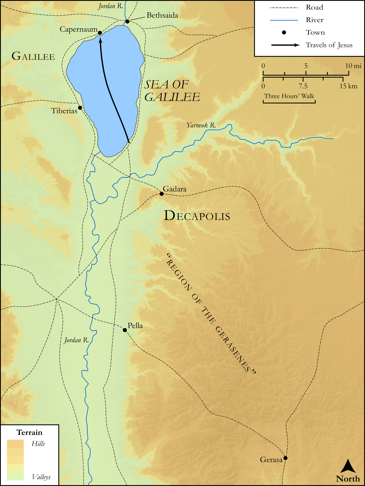

# Biblica Open Bible Maps

## License Information

Biblica Open Bible Maps, © 2023–2025 Biblica, Inc. This work is licensed under Creative Commons Attribution-ShareAlike 4.0 International (<a href="https://creativecommons.org/licenses/by-sa/4.0/">https://creativecommons.org/licenses/by-sa/4.0/</a>). More Information: <a href="https://docs.google.com/document/d/1Pp44yZ0Zdnd59vJHTrt2rPYq0SppfX5rZbPBt6mz37U/edit?tab=t.0#heading=h.oev9aj1ksvk2">https://docs.google.com/document/d/1Pp44yZ0Zdnd59vJHTrt2rPYq0SppfX5rZbPBt6mz37U/edit?tab=t.0#heading=h.oev9aj1ksvk2</a>

--------------------------------

## SRV Matthew: Matt. 8:23–27 (id: NT103)

### Image Content

[link](images/NT103.png)

Original: [SRV Matthew: Matt. 8:23\-27](https://drive.google.com/open?id=1IqSYyeE6cM4iIUDXtXkD10GziVIw_UCt&usp=drive_copy)

* **Associated Passages:** Matthew 8:1-34

* **Associated ACAI Concepts:** Jesus (ID: `person:Jesus.2`); Be Demon Possessed (ID: `keyterm:DemonPossessed`); Jackal (ID: `fauna:Jackal`); Serve (ID: `keyterm:Serve`); Ask for (ID: `keyterm:AskFor`); To Command (ID: `keyterm:Command`); To Cleanse (ID: `keyterm:Cleanse.2`); Believe (ID: `keyterm:Believe`); Pig (ID: `fauna:Pig`); Kingdom (ID: `keyterm:Kingdom`); Be a Disciple (ID: `keyterm:Disciple`); Sky (ID: `keyterm:Heaven`); Authority (ID: `keyterm:Authority.2`); Israel (ID: `person:Israel`); Centurion With Sick Servant (ID: `person:Centurion.2`); Religious Official (ID: `person:ReligiousOfficial`); A Disciple (ID: `person:GenericDisciple`); Having Little Faith (ID: `keyterm:HavingLittleFaith`); Infectious Skin Disease (ID: `keyterm:InfectiousSkinDisease`); Ship (ID: `realia:Ship`); House (ID: `realia:House`); Moses (ID: `person:Moses`); Ability (ID: `keyterm:Ability`); Surely! (ID: `keyterm:Surely`); Capernaum (ID: `place:Capernaum`); Offering (ID: `keyterm:Offering`); Gerasa (ID: `place:Gerasa`); To Cause to Happen (ID: `keyterm:Happen`); Isaac (ID: `person:Isaac`); Peter (ID: `person:Peter`); Salvation (ID: `keyterm:Salvation`); Isaiah (ID: `person:Isaiah`); Abraham (ID: `person:Abraham`); Bow Down (ID: `keyterm:BowDown`); Outer Darkness (ID: `keyterm:OuterDarkness`); Bear Witness (ID: `keyterm:BearWitness`); Housetop (ID: `realia:Housetop`); Grave (ID: `realia:Grave`)
