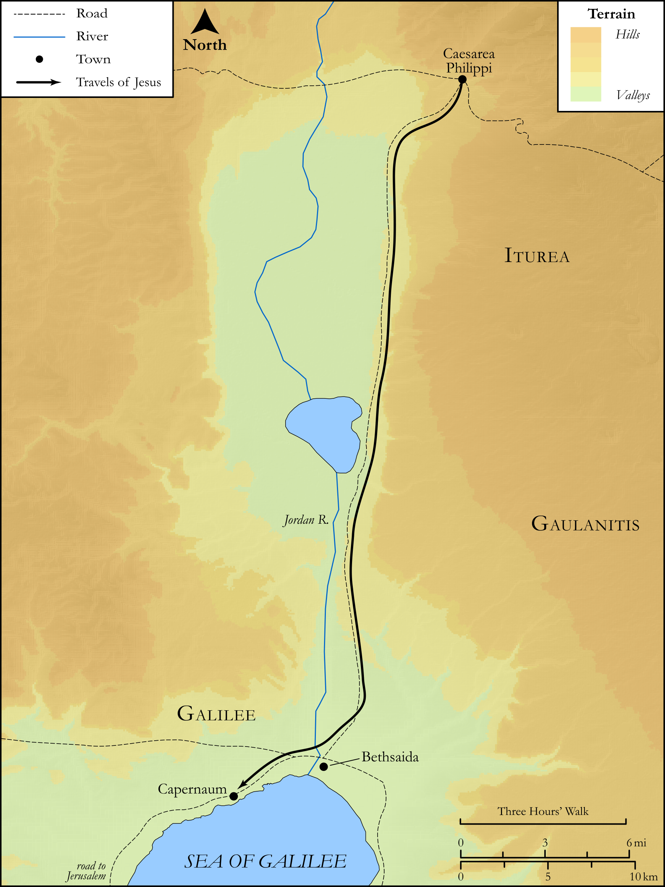

# Biblica Open Bible Maps

## License Information

Biblica Open Bible Maps, © 2023–2025 Biblica, Inc. This work is licensed under Creative Commons Attribution-ShareAlike 4.0 International (<a href="https://creativecommons.org/licenses/by-sa/4.0/">https://creativecommons.org/licenses/by-sa/4.0/</a>). More Information: <a href="https://docs.google.com/document/d/1Pp44yZ0Zdnd59vJHTrt2rPYq0SppfX5rZbPBt6mz37U/edit?tab=t.0#heading=h.oev9aj1ksvk2">https://docs.google.com/document/d/1Pp44yZ0Zdnd59vJHTrt2rPYq0SppfX5rZbPBt6mz37U/edit?tab=t.0#heading=h.oev9aj1ksvk2</a>

--------------------------------

## SRV Matthew: Matt. 9:27–38, Matt. 11:1–6 (id: NT105)

### Image Content

[link](images/NT105.png)

Original: [SRV Matthew: Matt. 9:27\-38, Matt. 11:1\-6](https://drive.google.com/open?id=1Cg_coZPSLsBJmhTXcGEr1RklmStzDyb-&usp=drive_copy)

* **Associated Passages:** Matthew 9:1-38

* **Associated ACAI Concepts:** Jesus (ID: `person:Jesus.2`); Be a Disciple (ID: `keyterm:Disciple`); House (ID: `realia:House`); Believe (ID: `keyterm:Believe`); Pharisees (ID: `group:Pharisee`); To Sin (ID: `keyterm:Sin`); Forgive (ID: `keyterm:Forgive`); Tax Collector (ID: `keyterm:TaxCollector`); Mercy (ID: `keyterm:Mercy`); Ability (ID: `keyterm:Ability`); Cheer Up (ID: `keyterm:CheerUp`); Salvation (ID: `keyterm:Salvation`); Authority (ID: `keyterm:Authority.2`); Abstain from Food (ID: `keyterm:Fast`); Demons (ID: `deity:Demons`); Affection (ID: `keyterm:Affection`); Matthew (ID: `person:Matthew`); Bed (ID: `realia:Bed`); Temple (ID: `realia:Temple`); Cloak (ID: `realia:Cloak`); Blaspheme (ID: `keyterm:Blaspheme`); Serve (ID: `keyterm:Serve`); Good News (ID: `keyterm:GoodNews`); Religious Officials (ID: `group:ReligiousOfficials`); Be (Or Show Oneself) Just (ID: `keyterm:Just`); Offering (ID: `keyterm:Offering`); Kingdom (ID: `keyterm:Kingdom`); Tax Office (ID: `keyterm:TaxOffice`); David (ID: `person:David`); LORD (ID: `deity:Lord`); Glory (ID: `keyterm:Glory`); Fear (ID: `keyterm:Fear`); Bleed (ID: `keyterm:Bleed`); Ask for (ID: `keyterm:AskFor`); Proclaim (ID: `keyterm:Proclaim`); John (ID: `person:John`); Israel (ID: `person:Israel`); Be Healthy (ID: `keyterm:Healthy`); Life (ID: `keyterm:Life`); Bow Down (ID: `keyterm:BowDown`); Heart (ID: `keyterm:Heart`); Be Demon Possessed (ID: `keyterm:DemonPossessed`); Tassel (ID: `realia:Tassel`); Patch (ID: `realia:Patch`); Must (ID: `realia:Must`); Wine (ID: `realia:Wine`); Flock (ID: `fauna:Flock`); Flute (ID: `realia:Flute`); Sheep (ID: `fauna:Lamb`); Ship (ID: `realia:Ship`); Skin-Bottle (ID: `realia:Skin-bottle`); Goat (ID: `fauna:Goat`); Synagogue (ID: `realia:Synagogue`); Clothing (ID: `realia:Clothing`)
