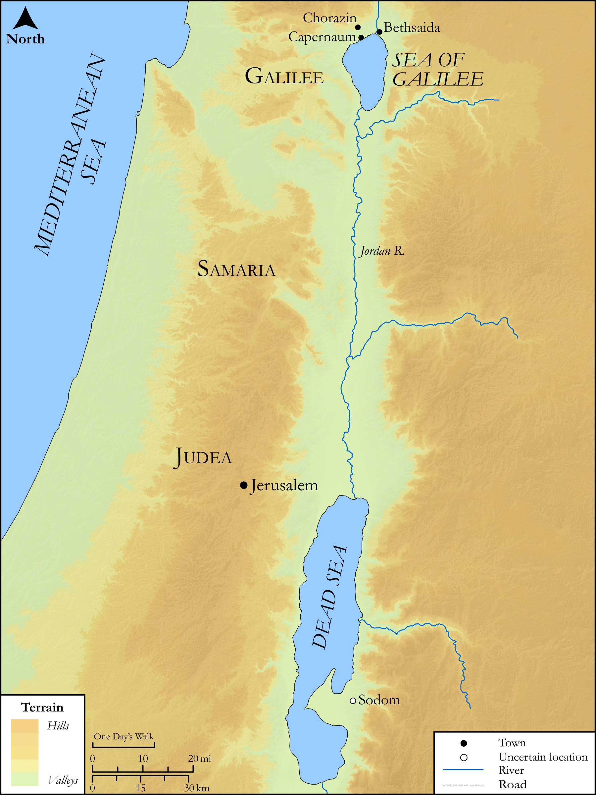

# Biblica Open Bible Maps

## License Information

Biblica Open Bible Maps, © 2023–2025 Biblica, Inc. This work is licensed under Creative Commons Attribution-ShareAlike 4.0 International (<a href="https://creativecommons.org/licenses/by-sa/4.0/">https://creativecommons.org/licenses/by-sa/4.0/</a>). More Information: <a href="https://docs.google.com/document/d/1Pp44yZ0Zdnd59vJHTrt2rPYq0SppfX5rZbPBt6mz37U/edit?tab=t.0#heading=h.oev9aj1ksvk2">https://docs.google.com/document/d/1Pp44yZ0Zdnd59vJHTrt2rPYq0SppfX5rZbPBt6mz37U/edit?tab=t.0#heading=h.oev9aj1ksvk2</a>

--------------------------------

## SRV Matthew: Matt. 11:20–23 (id: NT106)

### Image Content

[link](images/NT106.png)

Original: [SRV Matthew: Matt. 11:20\-23](https://drive.google.com/open?id=1fWRo0JSy46IOKyZJjxFYuyHm5zh6xUil&usp=drive_copy)

* **Associated Passages:** Matthew 11:1-30

* **Associated ACAI Concepts:** John (ID: `person:John`); Jesus (ID: `person:Jesus.2`); Sky (ID: `keyterm:Heaven`); Ability (ID: `keyterm:Ability`); LORD (ID: `deity:Lord`); Baptist (ID: `keyterm:Baptist`); Kingdom (ID: `keyterm:Kingdom`); Be a Disciple (ID: `keyterm:Disciple`); Sidon (ID: `place:Sidon`); Sodom (ID: `place:Sodom`); Tyre (ID: `place:Tyre`); Judgment (ID: `keyterm:Judgment`); Repent (ID: `keyterm:Repent`); Court Case (ID: `keyterm:CourtCase`); Yoke (ID: `realia:Yoke`); Disaster (ID: `keyterm:Disaster`); World of the Dead (ID: `keyterm:WorldOfTheDead`); Chorazin (ID: `place:Chorazin`); Hell (ID: `place:Hell`); Surely! (ID: `keyterm:Surely`); Speak as a Prophet (ID: `keyterm:Speak`); Capernaum (ID: `place:Capernaum`); Be (Or Show Oneself) Just (ID: `keyterm:Just`); Tax Collector (ID: `keyterm:TaxCollector`); An Angel (ID: `deity:Angel`); Resurrection (ID: `keyterm:Resurrection`); Elijah (ID: `person:Elijah`); Happy (ID: `keyterm:Happy`); Proclaim (ID: `keyterm:Proclaim`); To Cleanse (ID: `keyterm:Cleanse.2`); Good (ID: `keyterm:Good`); Heart (ID: `keyterm:Heart`); Demons (ID: `deity:Demons`); Law (ID: `keyterm:Law`); Bethsaida (ID: `place:Bethsaida`); Good News (ID: `keyterm:GoodNews`); Reed (ID: `flora:Reed`); Sackcloth (ID: `realia:Sackcloth`); Flute (ID: `realia:Flute`); Temple (ID: `realia:Temple`); House (ID: `realia:House`); Prison (ID: `realia:Prison`)
