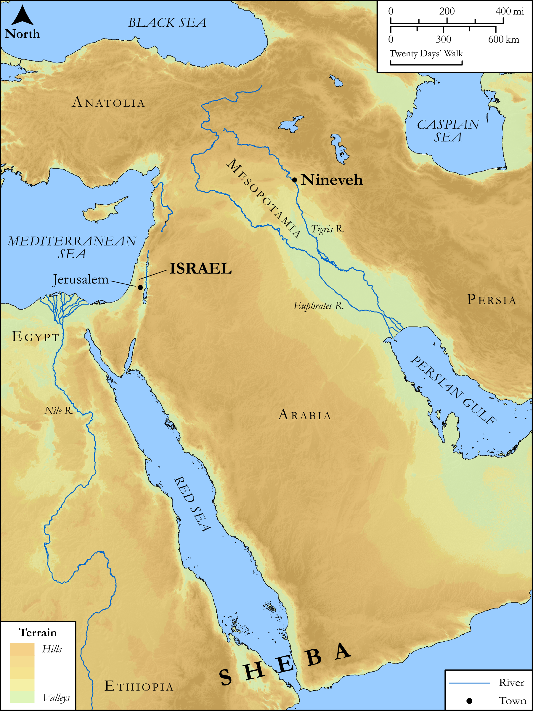

# Biblica Open Bible Maps

## License Information

Biblica Open Bible Maps, © 2023–2025 Biblica, Inc. This work is licensed under Creative Commons Attribution-ShareAlike 4.0 International (<a href="https://creativecommons.org/licenses/by-sa/4.0/">https://creativecommons.org/licenses/by-sa/4.0/</a>). More Information: <a href="https://docs.google.com/document/d/1Pp44yZ0Zdnd59vJHTrt2rPYq0SppfX5rZbPBt6mz37U/edit?tab=t.0#heading=h.oev9aj1ksvk2">https://docs.google.com/document/d/1Pp44yZ0Zdnd59vJHTrt2rPYq0SppfX5rZbPBt6mz37U/edit?tab=t.0#heading=h.oev9aj1ksvk2</a>

--------------------------------

## SRV Matthew: Matt. 12:38–44 (id: NT107)

### Image Content

[link](images/NT107.png)

Original: [SRV Matthew: Matt. 12:38\-44](https://drive.google.com/open?id=1AWxJWp5HqjXf3A4Nnx-jzoQFdV7LNTha&usp=drive_copy)

* **Associated Passages:** Matthew 12:1-50

* **Associated ACAI Concepts:** Sabbath (ID: `keyterm:Sabbath`); Judgment (ID: `keyterm:Judgment`); Be Lawful (ID: `keyterm:Lawful`); Pharisees (ID: `group:Pharisee`); Holy Spirit (ID: `deity:HolySpirit`); Jonah (ID: `person:Jonah.2`); Kingdom (ID: `keyterm:Kingdom`); Be a Disciple (ID: `keyterm:Disciple`); LORD (ID: `deity:Lord`); Satan (ID: `deity:Satan`); Court Case (ID: `keyterm:CourtCase`); Demons (ID: `deity:Demons`); Temple (ID: `realia:Temple`); Symbol (ID: `keyterm:Example`); Condemn (ID: `keyterm:Condemn`); Gentiles (ID: `group:Gentile`); Serve (ID: `keyterm:Serve`); David (ID: `person:David`); Jesus (ID: `person:Jesus.2`); Good (ID: `keyterm:Good`); Heart (ID: `keyterm:Heart`); Forgive (ID: `keyterm:Forgive`); House (ID: `realia:House`); Blaspheme (ID: `keyterm:Blaspheme`); Queen of Sheba (ID: `person:QueenOfSheba`); Ninevites (ID: `group:Nineveh`); Ability (ID: `keyterm:Ability`); Solomon (ID: `person:Solomon`); To Command (ID: `keyterm:Command`); Offering (ID: `keyterm:Offering`); To Cause to Happen (ID: `keyterm:Happen`); Defilement (ID: `keyterm:Defilement`); Always (ID: `keyterm:Always`); Nineveh (ID: `place:Nineveh`); Sky (ID: `keyterm:Heaven`); Be Unfaithful (ID: `keyterm:Unfaithful`); Name (ID: `keyterm:Name`); Proclaim (ID: `keyterm:Proclaim`); Mercy (ID: `keyterm:Mercy`); Word (ID: `keyterm:Word`); A Group of People (ID: `group:GenericGroup`); Isaiah (ID: `person:Isaiah`); Beloved (ID: `keyterm:Beloved`); To Sin (ID: `keyterm:Sin`); Hope (ID: `keyterm:Hope`); Repent (ID: `keyterm:Repent`); Law (ID: `keyterm:Law`); Be Demon Possessed (ID: `keyterm:DemonPossessed`); Useless (ID: `keyterm:Idle`); Sheep (ID: `fauna:Lamb`); Wheat (ID: `flora:Wheat`); Snake (ID: `fauna:Snake`); Fish (ID: `fauna:Fish`); Reed (ID: `flora:Reed`); Lamp (ID: `realia:Lamp`); Synagogue (ID: `realia:Synagogue`); Cobra (ID: `fauna:Cobra`); Grain (ID: `flora:Grain`)
