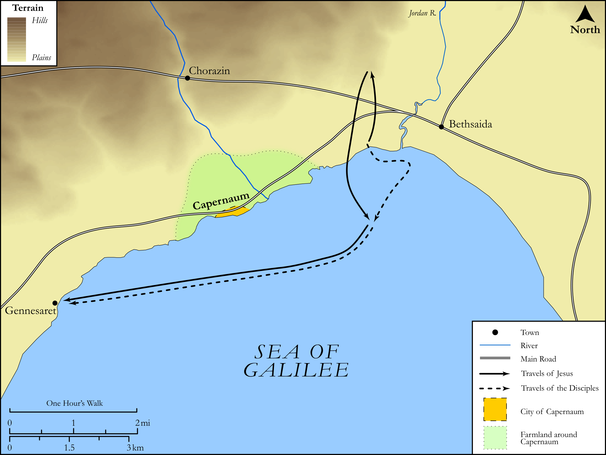

# Biblica Open Bible Maps

## License Information

Biblica Open Bible Maps, © 2023–2025 Biblica, Inc. This work is licensed under Creative Commons Attribution-ShareAlike 4.0 International (https://creativecommons.org/licenses/by-sa/4.0/). More Information: https://docs.google.com/document/d/1Pp44yZ0Zdnd59vJHTrt2rPYq0SppfX5rZbPBt6mz37U/edit?tab=t.0#heading=h.oev9aj1ksvk2

--------------------------------

## SRV Matthew: Matt. 14:22–36 (id: NT110)

### Image Content

[link](images/NT110.png)

Original: [SRV Matthew: Matt. 14:22\-36](https://drive.google.com/open?id=1Hml7njje9yuSACam8tvqH7kl8TNQUzyr&usp=drive_copy)

* **Associated Passages:** Matthew 14:1-36

* **Associated ACAI Concepts:** Jesus (ID: `person:Jesus.2`); John (ID: `person:John`); Be a Disciple (ID: `keyterm:Disciple`); Ship (ID: `realia:Ship`); Fear (ID: `keyterm:Fear`); Herod Antipas (ID: `person:Herod.2`); Herodias (ID: `person:Herodias`); Baptist (ID: `keyterm:Baptist`); Salvation (ID: `keyterm:Salvation`); Oath (ID: `keyterm:Oath`); Peter (ID: `person:Peter`); Fish (ID: `fauna:Fish`); Prison (ID: `realia:Prison`); Cheer Up (ID: `keyterm:CheerUp`); Having Little Faith (ID: `keyterm:HavingLittleFaith`); Philip (ID: `person:Philip.2`); Gennesaret (ID: `place:Gennesaret`); Daughter of Herodias (ID: `person:DaughterOfHerodias`); Plate (ID: `realia:Plate.2`); Affection (ID: `keyterm:Affection`); Bless (ID: `keyterm:Bless`); Ask for (ID: `keyterm:AskFor`); Resurrection (ID: `keyterm:Resurrection`); Be Lawful (ID: `keyterm:Lawful`); Bow Down (ID: `keyterm:BowDown`); Pray (ID: `keyterm:Pray`); True (ID: `keyterm:True`); Sky (ID: `keyterm:Heaven`); Ability (ID: `keyterm:Ability`); Serve (ID: `keyterm:Serve`); Basket (ID: `realia:Basket`); Grass (ID: `flora:Grass`); Tassel (ID: `realia:Tassel`); Cloak (ID: `realia:Cloak`); Stade (ID: `realia:Stade`)
