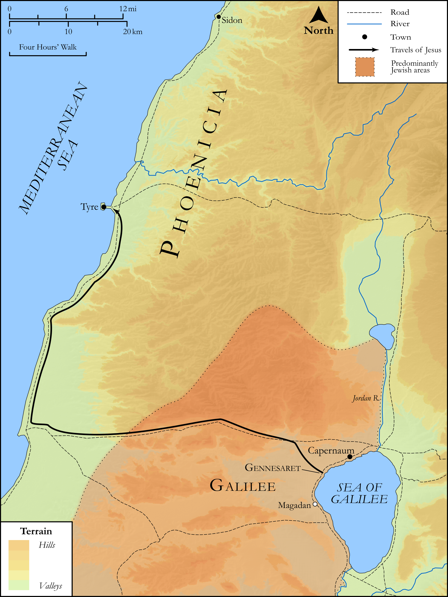

# Biblica Open Bible Maps

## License Information

Biblica Open Bible Maps, © 2023–2025 Biblica, Inc. This work is licensed under Creative Commons Attribution-ShareAlike 4.0 International (https://creativecommons.org/licenses/by-sa/4.0/). More Information: https://docs.google.com/document/d/1Pp44yZ0Zdnd59vJHTrt2rPYq0SppfX5rZbPBt6mz37U/edit?tab=t.0#heading=h.oev9aj1ksvk2

--------------------------------

## SRV Matthew: Matt. 15:21–28, Matt. 15:29–38 (id: NT112)

### Image Content

[link](images/NT112.png)

Original: [SRV Matthew: Matt. 15:21\-28, Matt. 15:29\-38](https://drive.google.com/open?id=16uEzgy59iwm68QPm80GrHhsEaKB3XUr0&usp=drive_copy)

* **Associated Passages:** Matthew 15:1-39

* **Associated ACAI Concepts:** Be a Disciple (ID: `keyterm:Disciple`); Jesus (ID: `person:Jesus.2`); LORD (ID: `deity:Lord`); Teaching (ID: `keyterm:Teaching`); Defilement (ID: `keyterm:Defilement`); A Group of Disciples (ID: `group:GenericDisciples`); Heart (ID: `keyterm:Heart`); Pharisees (ID: `group:Pharisee`); Israel (ID: `person:Israel`); Dog (ID: `fauna:Dog`); Syrophonecian Woman (ID: `person:SyrophonecianWoman`); Magadan (ID: `place:Magadan`); Tyre (ID: `place:Tyre`); Sidon (ID: `place:Sidon`); Fish (ID: `fauna:Fish`); Affection (ID: `keyterm:Affection`); Worship (ID: `keyterm:Worship`); Canaan (ID: `place:Canaan`); Fornication (ID: `keyterm:Fornication`); Believe (ID: `keyterm:Believe`); Jerusalem (ID: `place:Jerusalem`); Ask for (ID: `keyterm:AskFor`); Commandment (ID: `keyterm:Commandment`); Glory (ID: `keyterm:Glory`); Isaiah (ID: `person:Isaiah`); Parable (ID: `keyterm:Parable`); David (ID: `person:David`); Heavenly (ID: `keyterm:Heavenly`); Sea of Galilee (ID: `place:GalileeSea`); Speak as a Prophet (ID: `keyterm:Speak`); Canaanites (ID: `group:Canaan`); Offering (ID: `keyterm:Offering`); Bow Down (ID: `keyterm:BowDown`); Peter (ID: `person:Peter`); Be Demon Possessed (ID: `keyterm:DemonPossessed`); Serve (ID: `keyterm:Serve`); Blaspheme (ID: `keyterm:Blaspheme`); Honest (ID: `keyterm:Honest`); Mercy (ID: `keyterm:Mercy`); Basket (ID: `realia:Basket`); Sheep (ID: `fauna:Lamb`); Ship (ID: `realia:Ship`)
