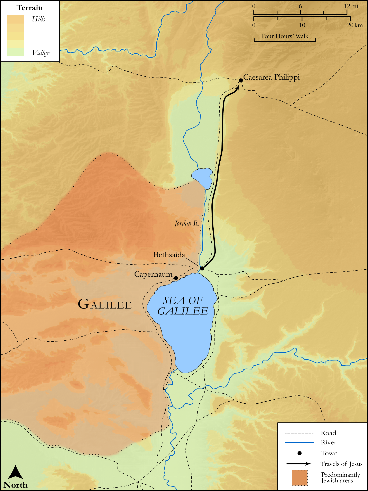

# Biblica Open Bible Maps

## License Information

Biblica Open Bible Maps, © 2023–2025 Biblica, Inc. This work is licensed under Creative Commons Attribution-ShareAlike 4.0 International (<a href="https://creativecommons.org/licenses/by-sa/4.0/">https://creativecommons.org/licenses/by-sa/4.0/</a>). More Information: <a href="https://docs.google.com/document/d/1Pp44yZ0Zdnd59vJHTrt2rPYq0SppfX5rZbPBt6mz37U/edit?tab=t.0#heading=h.oev9aj1ksvk2">https://docs.google.com/document/d/1Pp44yZ0Zdnd59vJHTrt2rPYq0SppfX5rZbPBt6mz37U/edit?tab=t.0#heading=h.oev9aj1ksvk2</a>

--------------------------------

## SRV Matthew: Matt. 16:13–19 (id: NT113)

### Image Content

[link](images/NT113.png)

Original: [SRV Matthew: Matt. 16:13\-19](https://drive.google.com/open?id=1BxnYetx6_VE6YL-JvHT5BGkjYEUqjq3Y&usp=drive_copy)

* **Associated Passages:** Matthew 16:1-28

* **Associated ACAI Concepts:** Jesus (ID: `person:Jesus.2`); Peter (ID: `person:Peter`); Be a Disciple (ID: `keyterm:Disciple`); Sky (ID: `keyterm:Heaven`); Sadducees (ID: `group:Sadducee`); Pharisees (ID: `group:Pharisee`); LORD (ID: `deity:Lord`); Symbol (ID: `keyterm:Example`); Life (ID: `keyterm:Life`); Kingdom (ID: `keyterm:Kingdom`); Basket (ID: `realia:Basket`); Caesarea Philippi (ID: `place:CaesareaPhilippi`); Church (ID: `keyterm:Church`); Discern (ID: `keyterm:Discern`); Hell (ID: `place:Hell`); Surely! (ID: `keyterm:Surely`); Ability (ID: `keyterm:Ability`); Jonah (ID: `person:Jonah.2`); To Command (ID: `keyterm:Command`); Stumbling Block (ID: `keyterm:StumblingBlock`); Jerusalem (ID: `place:Jerusalem`); An Angel (ID: `deity:Angel`); Glory (ID: `keyterm:Glory`); World of the Dead (ID: `keyterm:WorldOfTheDead`); Resurrection (ID: `keyterm:Resurrection`); Blood (ID: `keyterm:Blood`); Elijah (ID: `person:Elijah`); Be Unfaithful (ID: `keyterm:Unfaithful`); Happy (ID: `keyterm:Happy`); Jeremiah (ID: `person:Jeremiah.6`); Baptist (ID: `keyterm:Baptist`); Ask for (ID: `keyterm:AskFor`); John (ID: `person:John.4`); Satan (ID: `deity:Satan`); Salvation (ID: `keyterm:Salvation`); Think (ID: `keyterm:Think`); A Group of Disciples (ID: `group:GenericDisciples`); Having Little Faith (ID: `keyterm:HavingLittleFaith`); John (ID: `person:John`); Body (ID: `keyterm:Body.3`); Key (ID: `realia:Key`); Cross (ID: `realia:Cross`)
