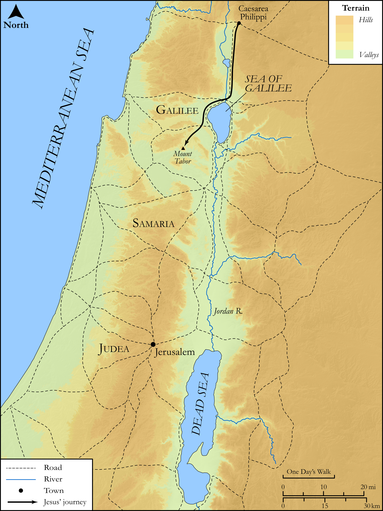

# Biblica Open Bible Maps

## License Information

Biblica Open Bible Maps, © 2023–2025 Biblica, Inc. This work is licensed under Creative Commons Attribution-ShareAlike 4.0 International (https://creativecommons.org/licenses/by-sa/4.0/). More Information: https://docs.google.com/document/d/1Pp44yZ0Zdnd59vJHTrt2rPYq0SppfX5rZbPBt6mz37U/edit?tab=t.0#heading=h.oev9aj1ksvk2

--------------------------------

## SRV Matthew: Matt. 17:1–12 (id: NT115)

### Image Content

[link](images/NT115.png)

Original: [SRV Matthew: Matt. 17:1\-12](https://drive.google.com/open?id=1TMMdlA6inFiEtzljiIbo-FR7Xv1ez_0B&usp=drive_copy)

* **Associated Passages:** Matthew 17:1-27

* **Associated ACAI Concepts:** Jesus (ID: `person:Jesus.2`); Elijah (ID: `person:Elijah`); Be a Disciple (ID: `keyterm:Disciple`); Peter (ID: `person:Peter`); Moses (ID: `person:Moses`); Resurrection (ID: `keyterm:Resurrection`); To Command (ID: `keyterm:Command`); Fear (ID: `keyterm:Fear`); Serve (ID: `keyterm:Serve`); Believe (ID: `keyterm:Believe`); Galilee (ID: `place:Galilee`); Baptist (ID: `keyterm:Baptist`); Surely! (ID: `keyterm:Surely`); John (ID: `person:John.2`); Poll Tax (ID: `keyterm:PollTax`); John (ID: `person:John`); Capernaum (ID: `place:Capernaum`); James (ID: `person:James`); Demons (ID: `deity:Demons`); Beloved (ID: `keyterm:Beloved`); A Group of Disciples (ID: `group:GenericDisciples`); Be Unfaithful (ID: `keyterm:Unfaithful`); Tax (ID: `keyterm:Tax`); Mercy (ID: `keyterm:Mercy`); Two-Drachma Piece (ID: `realia:Two-drachmaPiece`); Stater (ID: `realia:Stater`); Mustard (ID: `flora:Mustard`); Fishhook (ID: `realia:Fishhook`); Clothing (ID: `realia:Clothing`); Fish (ID: `fauna:Fish`); Tent (ID: `realia:Tent`); House (ID: `realia:House`); Grain (ID: `flora:Grain`)
