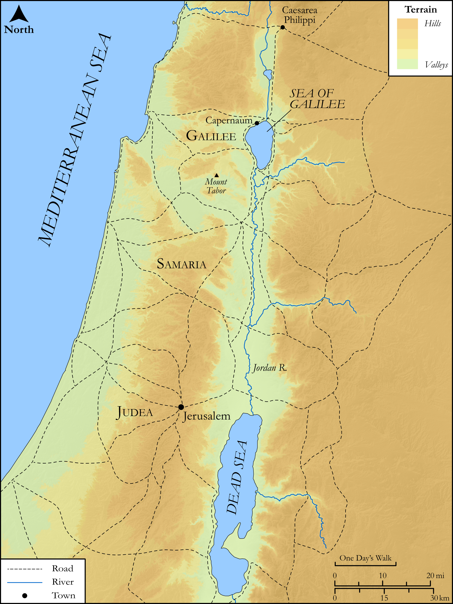

# Biblica Open Bible Maps

## License Information

Biblica Open Bible Maps, © 2023–2025 Biblica, Inc. This work is licensed under Creative Commons Attribution-ShareAlike 4.0 International (<a href="https://creativecommons.org/licenses/by-sa/4.0/">https://creativecommons.org/licenses/by-sa/4.0/</a>). More Information: <a href="https://docs.google.com/document/d/1Pp44yZ0Zdnd59vJHTrt2rPYq0SppfX5rZbPBt6mz37U/edit?tab=t.0#heading=h.oev9aj1ksvk2">https://docs.google.com/document/d/1Pp44yZ0Zdnd59vJHTrt2rPYq0SppfX5rZbPBt6mz37U/edit?tab=t.0#heading=h.oev9aj1ksvk2</a>

--------------------------------

## SRV Matthew: Matt. 17:22–26 (id: NT116)

### Image Content

[link](images/NT116.png)

Original: [SRV Matthew: Matt. 17:22\-26](https://drive.google.com/open?id=1zbZq8t5ljaPXRcltRs-2528GTo97ZOvP&usp=drive_copy)

* **Associated Passages:** Matthew 17:1-27

* **Associated ACAI Concepts:** Jesus (ID: `person:Jesus.2`); Elijah (ID: `person:Elijah`); Be a Disciple (ID: `keyterm:Disciple`); Peter (ID: `person:Peter`); Moses (ID: `person:Moses`); Serve (ID: `keyterm:Serve`); To Command (ID: `keyterm:Command`); Resurrection (ID: `keyterm:Resurrection`); Fear (ID: `keyterm:Fear`); Surely! (ID: `keyterm:Surely`); Tax (ID: `keyterm:Tax`); John (ID: `person:John.2`); Capernaum (ID: `place:Capernaum`); James (ID: `person:James`); Be Unfaithful (ID: `keyterm:Unfaithful`); Baptist (ID: `keyterm:Baptist`); Mercy (ID: `keyterm:Mercy`); Poll Tax (ID: `keyterm:PollTax`); A Group of Disciples (ID: `group:GenericDisciples`); Beloved (ID: `keyterm:Beloved`); John (ID: `person:John`); Believe (ID: `keyterm:Believe`); Demons (ID: `deity:Demons`); Galilee (ID: `place:Galilee`); Fishhook (ID: `realia:Fishhook`); Two-Drachma Piece (ID: `realia:Two-drachmaPiece`); Mustard (ID: `flora:Mustard`); Stater (ID: `realia:Stater`); Fish (ID: `fauna:Fish`); Clothing (ID: `realia:Clothing`); Tent (ID: `realia:Tent`); House (ID: `realia:House`); Grain (ID: `flora:Grain`)
