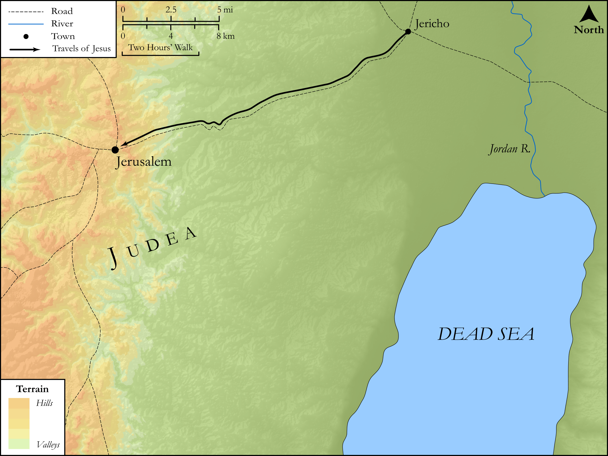

# Biblica Open Bible Maps

## License Information

Biblica Open Bible Maps, © 2023–2025 Biblica, Inc. This work is licensed under Creative Commons Attribution-ShareAlike 4.0 International (https://creativecommons.org/licenses/by-sa/4.0/). More Information: https://docs.google.com/document/d/1Pp44yZ0Zdnd59vJHTrt2rPYq0SppfX5rZbPBt6mz37U/edit?tab=t.0#heading=h.oev9aj1ksvk2

--------------------------------

## SRV Matthew: Matt. 20:17–27 (id: NT118)

### Image Content

[link](images/NT118.png)

Original: [SRV Matthew: Matt. 20:17\-27](https://drive.google.com/open?id=1nHlsuJB_fkI34q9fPvssiwHlHVyccwvj&usp=drive_copy)

* **Associated Passages:** Matthew 20:1-34

* **Associated ACAI Concepts:** Jesus (ID: `person:Jesus.2`); Vine (ID: `flora:Vine`); Denarius (ID: `realia:Denarius`); Useless (ID: `keyterm:Idle`); Jerusalem (ID: `place:Jerusalem`); Kingdom (ID: `keyterm:Kingdom`); David (ID: `person:David`); Mercy (ID: `keyterm:Mercy`); To Command (ID: `keyterm:Command`); Serve (ID: `keyterm:Serve`); Affection (ID: `keyterm:Affection`); LORD (ID: `deity:Lord`); Jericho (ID: `place:Jericho`); Zebedee (ID: `person:Zebedee`); Resurrection (ID: `keyterm:Resurrection`); Good (ID: `keyterm:Good`); Life (ID: `keyterm:Life`); Ransom (ID: `keyterm:Ransom`); Be (Or Show Oneself) Just (ID: `keyterm:Just`); Be Lawful (ID: `keyterm:Lawful`); Bow Down (ID: `keyterm:BowDown`); Sky (ID: `keyterm:Heaven`); To Act Wickedly (ID: `keyterm:ActWickedly`); Be a Disciple (ID: `keyterm:Disciple`); Condemn (ID: `keyterm:Condemn`); Gentiles (ID: `group:Gentile`); Authority (ID: `keyterm:Authority.2`); Cross (ID: `realia:Cross`)
