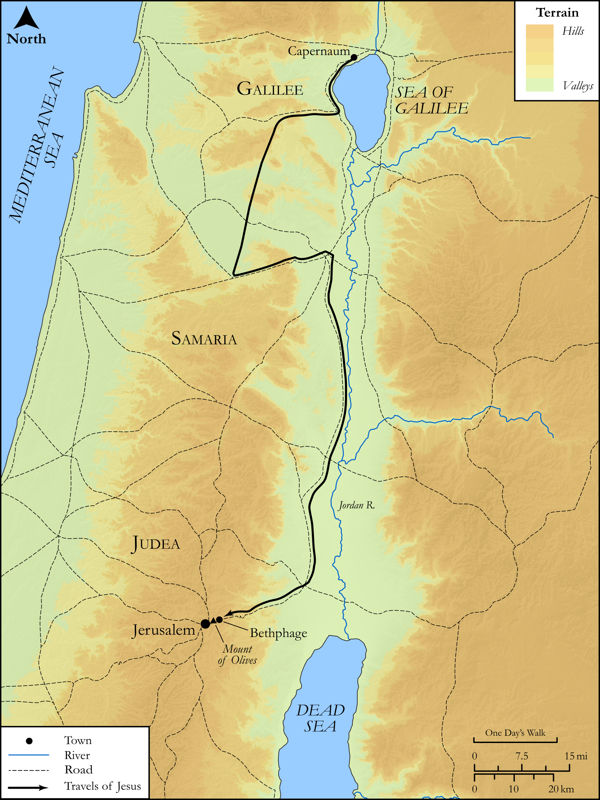

# Biblica Open Bible Maps

## License Information

Biblica Open Bible Maps, © 2023–2025 Biblica, Inc. This work is licensed under Creative Commons Attribution-ShareAlike 4.0 International (https://creativecommons.org/licenses/by-sa/4.0/). More Information: https://docs.google.com/document/d/1Pp44yZ0Zdnd59vJHTrt2rPYq0SppfX5rZbPBt6mz37U/edit?tab=t.0#heading=h.oev9aj1ksvk2

--------------------------------

## SRV Matthew: Matt. 21:1–10 (id: NT120)

### Image Content

[link](images/NT120.png)

Original: [SRV Matthew: Matt. 21:1\-10](https://drive.google.com/open?id=1_IqJkO_QWUumz-UQi4xP-_gFXhFJDJU3&usp=drive_copy)

* **Associated Passages:** Matthew 21:1-46

* **Associated ACAI Concepts:** Jesus (ID: `person:Jesus.2`); Temple (ID: `realia:Temple`); LORD (ID: `deity:Lord`); Believe (ID: `keyterm:Believe`); Vine (ID: `flora:Vine`); Jerusalem (ID: `place:Jerusalem`); Ability (ID: `keyterm:Ability`); Authority (ID: `keyterm:Authority.2`); Be a Disciple (ID: `keyterm:Disciple`); John (ID: `person:John`); Hosanna (ID: `keyterm:Hosanna`); Tax Collector (ID: `keyterm:TaxCollector`); Fig (ID: `flora:Fig`); Parable (ID: `keyterm:Parable`); Kingdom (ID: `keyterm:Kingdom`); Pray (ID: `keyterm:Pray`); Surely! (ID: `keyterm:Surely`); David (ID: `person:David`); Repent (ID: `keyterm:Repent`); Fear (ID: `keyterm:Fear`); Donkey (ID: `fauna:Donkey`); Bethphage (ID: `place:Bethphage`); Reject (ID: `keyterm:Reject`); Baptism (ID: `keyterm:Baptism`); Ask for (ID: `keyterm:AskFor`); Always (ID: `keyterm:Always`); Serve (ID: `keyterm:Serve`); Discern (ID: `keyterm:Discern`); Galilee (ID: `place:Galilee`); Bethany (ID: `place:Bethany`); Written (ID: `keyterm:Scripture`); Height (ID: `keyterm:Height`); To Cause to Happen (ID: `keyterm:Happen`); Pharisees (ID: `group:Pharisee`); Bless (ID: `keyterm:Bless`); A Group of People (ID: `group:GenericGroup`); To Command (ID: `keyterm:Command`); Sky (ID: `keyterm:Heaven`); Name (ID: `keyterm:Name`); Be (Or Show Oneself) Just (ID: `keyterm:Just`); Nazareth (ID: `place:Nazareth`); Clothing (ID: `realia:Clothing`); Cornerstone (ID: `realia:Cornerstone`); Winepress (ID: `realia:Winepress`); Seat (ID: `realia:Seat`); Tower (ID: `realia:Tower`); Dove (ID: `fauna:Dove`); Olive Tree (ID: `flora:OliveTree`); House (ID: `realia:House`); Thorn Hedge (ID: `realia:ThornHedge`); Watch-Tower (ID: `realia:Watch-tower`)
