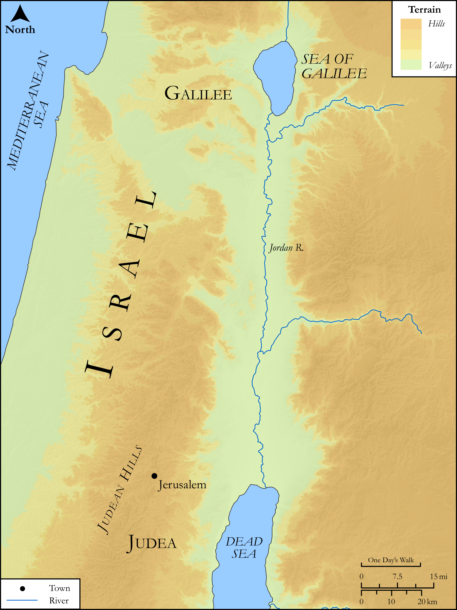

# Biblica Open Bible Maps

## License Information

Biblica Open Bible Maps, © 2023–2025 Biblica, Inc. This work is licensed under Creative Commons Attribution-ShareAlike 4.0 International (https://creativecommons.org/licenses/by-sa/4.0/). More Information: https://docs.google.com/document/d/1Pp44yZ0Zdnd59vJHTrt2rPYq0SppfX5rZbPBt6mz37U/edit?tab=t.0#heading=h.oev9aj1ksvk2

--------------------------------

## SRV Matthew: Matt. 24:15–27 (id: NT121)

### Image Content

[link](images/NT121.png)

Original: [SRV Matthew: Matt. 24:15\-27](https://drive.google.com/open?id=1hJkYAJYDxumMXxQjIC_SHmYH5xAhMSSn&usp=drive_copy)

* **Associated Passages:** Matthew 24:1-51

* **Associated ACAI Concepts:** Jesus (ID: `person:Jesus.2`); Sky (ID: `keyterm:Heaven`); Ability (ID: `keyterm:Ability`); Symbol (ID: `keyterm:Example`); Surely! (ID: `keyterm:Surely`); Chosen (ID: `keyterm:Chosen`); Noah (ID: `person:Noah`); An Angel (ID: `deity:Angel`); Kingdom (ID: `keyterm:Kingdom`); Believe (ID: `keyterm:Believe`); Salvation (ID: `keyterm:Salvation`); Be a Disciple (ID: `keyterm:Disciple`); Name (ID: `keyterm:Name`); Daniel (ID: `person:Daniel.3`); Faithfulness (ID: `keyterm:Faithfulness`); Holy (ID: `keyterm:Holy`); LORD (ID: `deity:Lord`); Portent (ID: `keyterm:Portent`); Abomination of Desolation (ID: `keyterm:AbominationOfDesolation`); Parable (ID: `keyterm:Parable`); Glory (ID: `keyterm:Glory`); Always (ID: `keyterm:Always`); Bear Witness (ID: `keyterm:BearWitness`); Proclaim (ID: `keyterm:Proclaim`); Pray (ID: `keyterm:Pray`); Sabbath (ID: `keyterm:Sabbath`); Happy (ID: `keyterm:Happy`); Disaster (ID: `keyterm:Disaster`); Body (ID: `keyterm:Body.3`); Lawless (ID: `keyterm:Lawless`)
