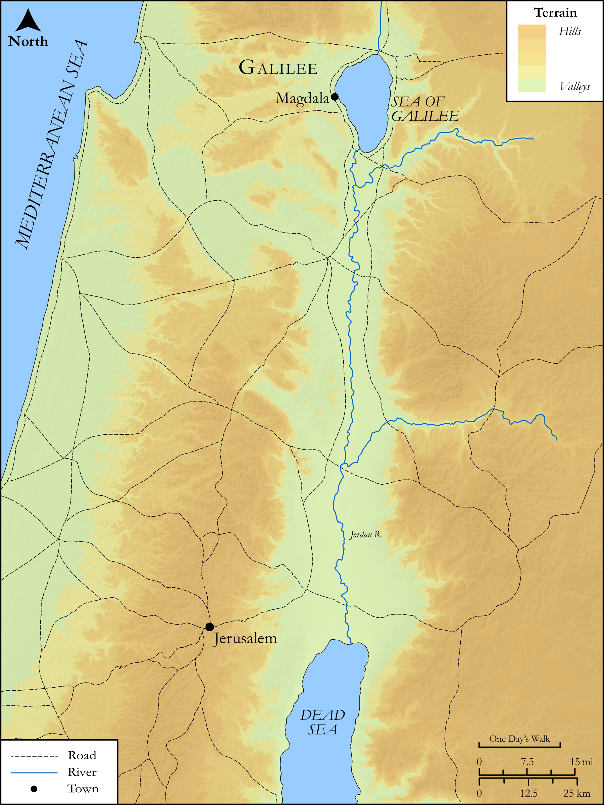

# Biblica Open Bible Maps

## License Information

Biblica Open Bible Maps, © 2023–2025 Biblica, Inc. This work is licensed under Creative Commons Attribution-ShareAlike 4.0 International (https://creativecommons.org/licenses/by-sa/4.0/). More Information: https://docs.google.com/document/d/1Pp44yZ0Zdnd59vJHTrt2rPYq0SppfX5rZbPBt6mz37U/edit?tab=t.0#heading=h.oev9aj1ksvk2

--------------------------------

## SRV Matthew: Matt. 27:45–55 (id: NT127)

### Image Content

[link](images/NT127.png)

Original: [SRV Matthew: Matt. 27:45\-55](https://drive.google.com/open?id=1EOLDoOaBK__nSOtntaHg2b0UtZfxfTPs&usp=drive_copy)

* **Associated Passages:** Matthew 27:1-66

* **Associated ACAI Concepts:** Jesus (ID: `person:Jesus.2`); Pilate (ID: `person:Pilate`); A Group of People (ID: `group:GenericGroup`); Barabbas (ID: `person:Barabbas`); Blood (ID: `keyterm:Blood`); Cross (ID: `realia:Cross`); Grave (ID: `realia:Grave`); Resurrection (ID: `keyterm:Resurrection`); Akeldama (ID: `place:Akeldama`); LORD (ID: `deity:Lord`); Salvation (ID: `keyterm:Salvation`); Jews (ID: `group:Jews`); Body (ID: `keyterm:Body.3`); Joseph (ID: `person:Joseph.6`); Mary (ID: `person:Mary.2`); Mary Magdalene (ID: `person:Marymagdalene`); Persuade (ID: `keyterm:Persuade`); Elijah (ID: `person:Elijah`); Name (ID: `keyterm:Name`); Be a Disciple (ID: `keyterm:Disciple`); Israel (ID: `person:Israel`); Holy (ID: `keyterm:Holy`); Reed (ID: `flora:Reed`); Temple (ID: `realia:Temple`); Golgotha (ID: `place:Golgotha`); Zebedee (ID: `person:Zebedee`); Temple Treasury (ID: `place:Corban`); Cyrene (ID: `place:Cyrene`); Simon (ID: `person:Simon.5`); James (ID: `person:James.4`)
