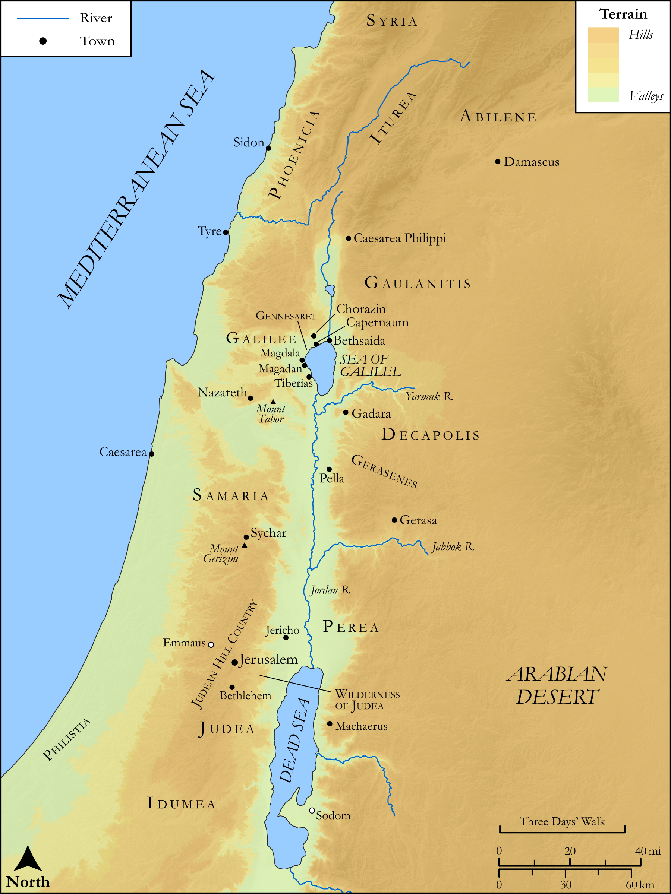

# Biblica Open Bible Maps

## License Information

Biblica Open Bible Maps, © 2023–2025 Biblica, Inc. This work is licensed under Creative Commons Attribution-ShareAlike 4.0 International (https://creativecommons.org/licenses/by-sa/4.0/). More Information: https://docs.google.com/document/d/1Pp44yZ0Zdnd59vJHTrt2rPYq0SppfX5rZbPBt6mz37U/edit?tab=t.0#heading=h.oev9aj1ksvk2

--------------------------------

## SRV Matthew: All Matthew Sites (Levant) (id: NT129)

### Image Content

[link](images/NT129.png)

Original: [SRV Matthew: All Matthew Sites (Levant)](https://drive.google.com/open?id=1okLd7TpmDrxoeikaMZAxgo7Ktw-XixhI&usp=drive_copy)

* **Associated Passages:** Matthew 1:1-28:20

* **Associated ACAI Concepts:** Jesus (ID: `person:Jesus.2`); LORD (ID: `deity:Lord`); Sky (ID: `keyterm:Heaven`); Be a Disciple (ID: `keyterm:Disciple`); Kingdom (ID: `keyterm:Kingdom`); Ability (ID: `keyterm:Ability`); Surely! (ID: `keyterm:Surely`); Pharisees (ID: `group:Pharisee`); Peter (ID: `person:Peter`); John (ID: `person:John`); Be (Or Show Oneself) Just (ID: `keyterm:Just`); Serve (ID: `keyterm:Serve`); Name (ID: `keyterm:Name`); An Angel (ID: `deity:Angel`); Fear (ID: `keyterm:Fear`); Life (ID: `keyterm:Life`); Resurrection (ID: `keyterm:Resurrection`); Believe (ID: `keyterm:Believe`); Parable (ID: `keyterm:Parable`); Heart (ID: `keyterm:Heart`); Body (ID: `keyterm:Body.3`); To Command (ID: `keyterm:Command`); Galilee (ID: `place:Galilee`); Israel (ID: `person:Israel`); David (ID: `person:David`); Pray (ID: `keyterm:Pray`); Ask for (ID: `keyterm:AskFor`); Salvation (ID: `keyterm:Salvation`); Bow Down (ID: `keyterm:BowDown`); To Cause to Happen (ID: `keyterm:Happen`)
