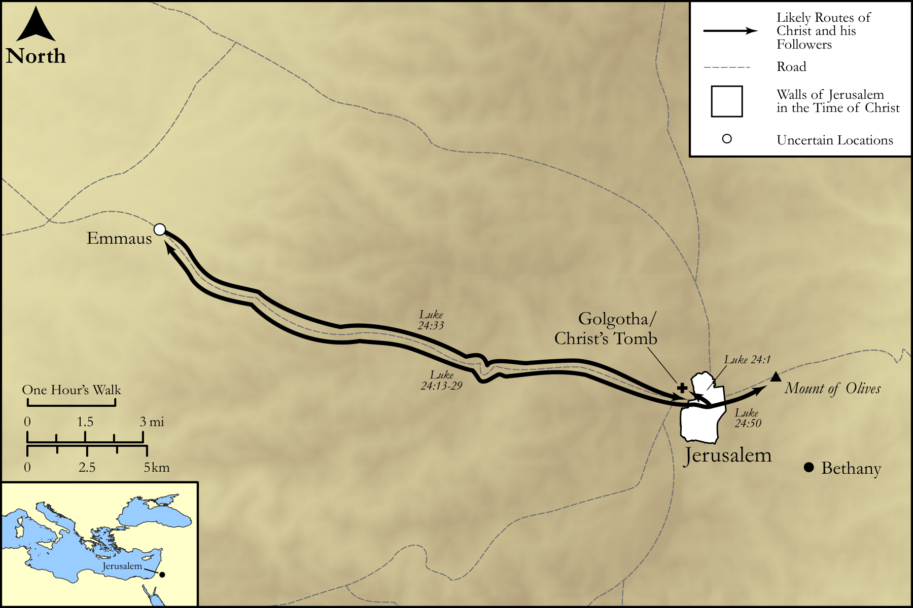

# Biblica Open Bible Maps

## License Information

Biblica Open Bible Maps, © 2023–2025 Biblica, Inc. This work is licensed under Creative Commons Attribution-ShareAlike 4.0 International (https://creativecommons.org/licenses/by-sa/4.0/). More Information: https://docs.google.com/document/d/1Pp44yZ0Zdnd59vJHTrt2rPYq0SppfX5rZbPBt6mz37U/edit?tab=t.0#heading=h.oev9aj1ksvk2

--------------------------------

## The Life of Jesus: Jesus' Resurrection (id: NT021)

### Image Content

[link](images/NT021.png)

Original: [The Life of Jesus: Jesus' Resurrection](https://drive.google.com/open?id=1BIA0Az-5QNoJmGQr7olpZPVWKHfUsrqM&usp=drive_copy)

* **Associated Passages:** Luke 24:1-53

* **Associated ACAI Concepts:** Jesus (ID: `person:Jesus.2`); Jerusalem (ID: `place:Jerusalem`); Grave (ID: `realia:Grave`); Bless (ID: `keyterm:Bless`); Written (ID: `keyterm:Scripture`); LORD (ID: `deity:Lord`); Body (ID: `keyterm:Body.3`); Heart (ID: `keyterm:Heart`); Name (ID: `keyterm:Name`); Word (ID: `keyterm:Word`); Cause of Joy (ID: `keyterm:CauseOfJoy`); Spirit (ID: `keyterm:Spirit.2`); Peter (ID: `person:Peter`); Disbelieve (ID: `keyterm:Disbelieve`); Moses (ID: `person:Moses`); Resurrection (ID: `keyterm:Resurrection`); Life (ID: `keyterm:Life`); Week (ID: `keyterm:Week`); Bow Down (ID: `keyterm:BowDown`); Cleopas (ID: `person:Cleopas`); Joanna (ID: `person:Joanna`); Bethany (ID: `place:Bethany`); To Cause to Happen (ID: `keyterm:Happen`); Emmaus (ID: `place:Emmaus`); Witness (ID: `keyterm:Witness`); Israel (ID: `person:Israel`); An Angel (ID: `deity:Angel`); Forgive (ID: `keyterm:Forgive`); Glory (ID: `keyterm:Glory`); Hope (ID: `keyterm:Hope`)
