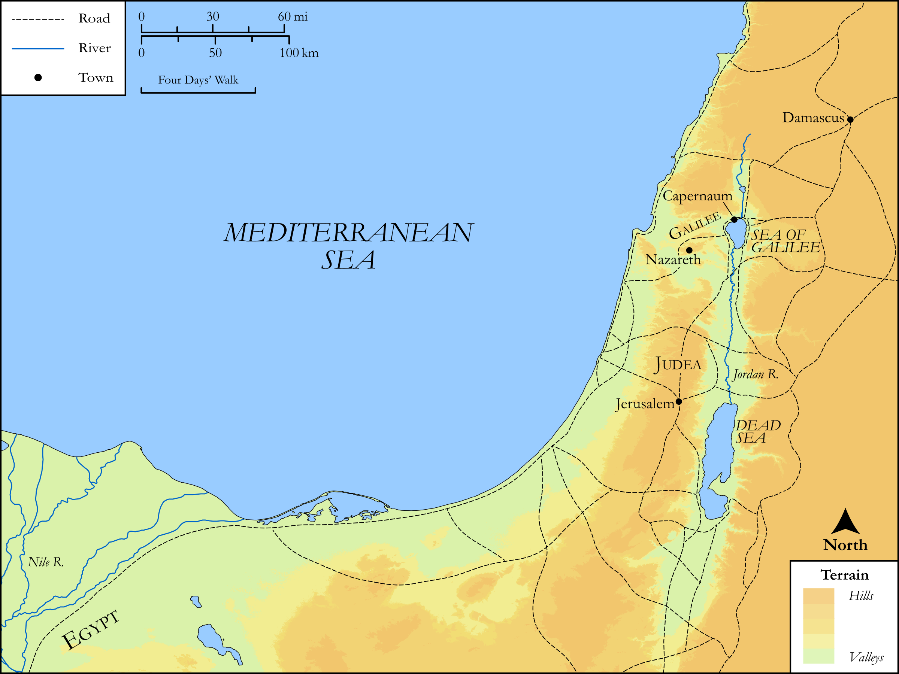

# Biblica Open Bible Maps

## License Information

Biblica Open Bible Maps, © 2023–2025 Biblica, Inc. This work is licensed under Creative Commons Attribution-ShareAlike 4.0 International (https://creativecommons.org/licenses/by-sa/4.0/). More Information: https://docs.google.com/document/d/1Pp44yZ0Zdnd59vJHTrt2rPYq0SppfX5rZbPBt6mz37U/edit?tab=t.0#heading=h.oev9aj1ksvk2

--------------------------------

## SRV Mark: Mark 1:21–27 (id: NT153)

### Image Content

[link](images/NT153.png)

Original: [SRV Mark: Mark 1:21\-27](https://drive.google.com/open?id=1KsHMl4kGofRsmerszT9ohB7c4Xe92RCT&usp=drive_copy)

* **Associated Passages:** Mark 1:1-45

* **Associated ACAI Concepts:** Proclaim (ID: `keyterm:Proclaim`); Jesus (ID: `person:Jesus.2`); Galilee (ID: `place:Galilee`); John (ID: `person:John`); Baptism (ID: `keyterm:Baptism`); LORD (ID: `deity:Lord`); Peter (ID: `person:Peter`); To Cleanse (ID: `keyterm:Cleanse.2`); Good News (ID: `keyterm:GoodNews`); Synagogue (ID: `realia:Synagogue`); Holy Spirit (ID: `deity:HolySpirit`); Serve (ID: `keyterm:Serve`); Jordan River (ID: `place:Jordan`); Zebedee (ID: `person:Zebedee`); James (ID: `person:James`); Andrew (ID: `person:Andrew`); An Angel (ID: `deity:Angel`); Ability (ID: `keyterm:Ability`); Authority (ID: `keyterm:Authority.2`); Repent (ID: `keyterm:Repent`); Demons (ID: `deity:Demons`); Sky (ID: `keyterm:Heaven`); To Sin (ID: `keyterm:Sin`); John (ID: `person:John.2`); Nazareth (ID: `place:Nazareth`); Hired Worker (ID: `keyterm:HiredWorker`); Capernaum (ID: `place:Capernaum`); Sea of Galilee (ID: `place:GalileeSea`); Infectious Skin Disease (ID: `keyterm:InfectiousSkinDisease`); Holy (ID: `keyterm:Holy`); Ask for (ID: `keyterm:AskFor`); Be Demon Possessed (ID: `keyterm:DemonPossessed`); Forgive (ID: `keyterm:Forgive`); Beloved (ID: `keyterm:Beloved`); Kingdom (ID: `keyterm:Kingdom`); Bear Witness (ID: `keyterm:BearWitness`); Casting Net (ID: `realia:CastingNet`); Pray (ID: `keyterm:Pray`); Offering (ID: `keyterm:Offering`); Sabbath (ID: `keyterm:Sabbath`); Believe (ID: `keyterm:Believe`); Fishnet (ID: `realia:Fishnet`); Put to the Test (ID: `keyterm:PutToTheTest`); Moses (ID: `person:Moses`); To Command (ID: `keyterm:Command`); Straightness (ID: `keyterm:Straightness`); Isaiah (ID: `person:Isaiah`); Satan (ID: `deity:Satan`); Jerusalem (ID: `place:Jerusalem`); Ship (ID: `realia:Ship`); Judea (ID: `place:Judea`); Strap (ID: `realia:Strap`); Bee (ID: `fauna:Bee`); Dove (ID: `fauna:Dove`); Belt (ID: `realia:Belt`); Camel (ID: `fauna:Camel`); Sandal (ID: `realia:Sandal`); Bag (ID: `realia:Bag`); House (ID: `realia:House`); Leather (ID: `realia:Leather`); Locust (ID: `fauna:Locust`)
