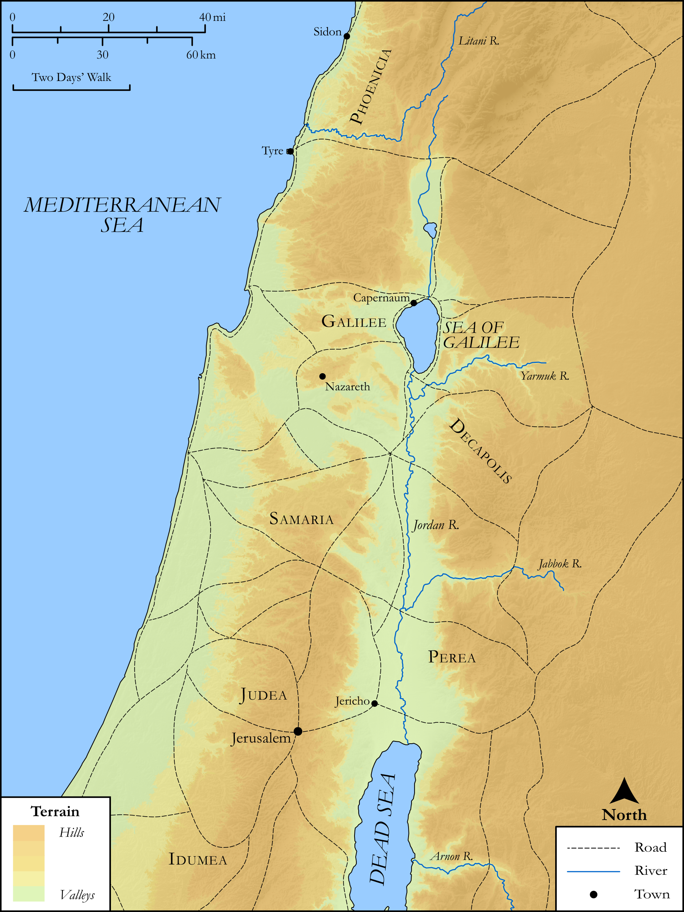

# Biblica Open Bible Maps

## License Information

Biblica Open Bible Maps, © 2023–2025 Biblica, Inc. This work is licensed under Creative Commons Attribution-ShareAlike 4.0 International (https://creativecommons.org/licenses/by-sa/4.0/). More Information: https://docs.google.com/document/d/1Pp44yZ0Zdnd59vJHTrt2rPYq0SppfX5rZbPBt6mz37U/edit?tab=t.0#heading=h.oev9aj1ksvk2

--------------------------------

## SRV Mark: Mark 3:7–11 (id: NT155)

### Image Content

[link](images/NT155.png)

Original: [SRV Mark: Mark 3:7\-11](https://drive.google.com/open?id=1NiRx4t7BRWfRXQkEsUlMuUaKLH28_QRP&usp=drive_copy)

* **Associated Passages:** Mark 3:1-35

* **Associated ACAI Concepts:** Satan (ID: `deity:Satan`); Blaspheme (ID: `keyterm:Blaspheme`); Forgive (ID: `keyterm:Forgive`); Serve (ID: `keyterm:Serve`); Sabbath (ID: `keyterm:Sabbath`); Be a Disciple (ID: `keyterm:Disciple`); Demons (ID: `deity:Demons`); Name (ID: `keyterm:Name`); To Sin (ID: `keyterm:Sin`); Jerusalem (ID: `place:Jerusalem`); Bartholomew (ID: `person:Bartholomew`); Be Lawful (ID: `keyterm:Lawful`); James (ID: `person:James.2`); Zealots (ID: `group:Zealot`); Alphaeus (ID: `person:Alphaeus`); Idumea (ID: `place:Idumea`); James (ID: `person:James`); John (ID: `person:John.2`); Herodians (ID: `group:Herodian`); House (ID: `realia:House`); Andrew (ID: `person:Andrew`); Judas (ID: `person:Judas.2`); LORD (ID: `deity:Lord`); Philip (ID: `person:Philip`); Holy Spirit (ID: `deity:HolySpirit`); Parable (ID: `keyterm:Parable`); Thomas (ID: `person:Thomas`); Religious Officials (ID: `group:ReligiousOfficials`); Always (ID: `keyterm:Always`); Jesus (ID: `person:Jesus.2`); Ability (ID: `keyterm:Ability`); Peter (ID: `person:Peter`); Kingdom (ID: `keyterm:Kingdom`); Authority (ID: `keyterm:Authority.2`); Proclaim (ID: `keyterm:Proclaim`); Galilee (ID: `place:Galilee`); Surely! (ID: `keyterm:Surely`); Sidon (ID: `place:Sidon`); Salvation (ID: `keyterm:Salvation`); Zebedee (ID: `person:Zebedee`); Pharisees (ID: `group:Pharisee`); Judas (ID: `person:Judas`); Simon (ID: `person:Simon.2`); Tyre (ID: `place:Tyre`); To Command (ID: `keyterm:Command`); Heart (ID: `keyterm:Heart`); Matthew (ID: `person:Matthew`); Life (ID: `keyterm:Life`); Jordan River (ID: `place:Jordan`); Judea (ID: `place:Judea`); Temple (ID: `realia:Temple`); Ship (ID: `realia:Ship`); Synagogue (ID: `realia:Synagogue`)
