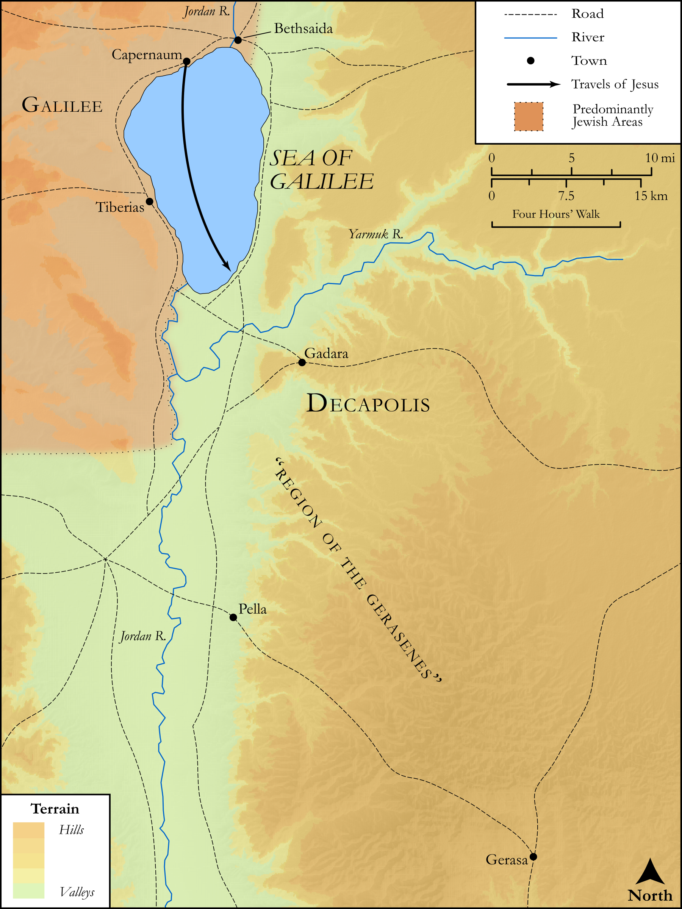

# Biblica Open Bible Maps

## License Information

Biblica Open Bible Maps, © 2023–2025 Biblica, Inc. This work is licensed under Creative Commons Attribution-ShareAlike 4.0 International (<a href="https://creativecommons.org/licenses/by-sa/4.0/">https://creativecommons.org/licenses/by-sa/4.0/</a>). More Information: <a href="https://docs.google.com/document/d/1Pp44yZ0Zdnd59vJHTrt2rPYq0SppfX5rZbPBt6mz37U/edit?tab=t.0#heading=h.oev9aj1ksvk2">https://docs.google.com/document/d/1Pp44yZ0Zdnd59vJHTrt2rPYq0SppfX5rZbPBt6mz37U/edit?tab=t.0#heading=h.oev9aj1ksvk2</a>

--------------------------------

## SRV Mark: Mark 4:35–41, Mark 5:1–19 (id: NT156)

### Image Content

[link](images/NT156.png)

Original: [SRV Mark: Mark 4:35\-41, Mark 5:1\-19](https://drive.google.com/open?id=16zPi5OofVOW5eFGNu-BzKzqbLg8iM-TV&usp=drive_copy)

* **Associated Passages:** Mark 4:1-41

* **Associated ACAI Concepts:** Parable (ID: `keyterm:Parable`); Grain (ID: `flora:Grain`); Kingdom (ID: `keyterm:Kingdom`); LORD (ID: `deity:Lord`); Ship (ID: `realia:Ship`); To Command (ID: `keyterm:Command`); Boxthorn (ID: `flora:Boxthorn`); Barley (ID: `flora:Barley`); Brier (ID: `flora:Brier`); Acacia (ID: `flora:Acacia`); Grass (ID: `flora:Grass`); Thistle (ID: `flora:Thistle`); Ability (ID: `keyterm:Ability`); Cause of Joy (ID: `keyterm:CauseOfJoy`); Be a Disciple (ID: `keyterm:Disciple`); Sky (ID: `keyterm:Heaven`); Always (ID: `keyterm:Always`); Fear (ID: `keyterm:Fear`); Ask for (ID: `keyterm:AskFor`); Satan (ID: `deity:Satan`); Believe (ID: `keyterm:Believe`); Forgive (ID: `keyterm:Forgive`); Become Still (ID: `keyterm:BecomeStill`); Cushion (ID: `realia:Cushion`); Mustard (ID: `flora:Mustard`); Wheat (ID: `flora:Wheat`); Bed (ID: `realia:Bed`); Rooster (ID: `fauna:Rooster`); Sickle (ID: `realia:Sickle`); Lampstand (ID: `realia:Lampstand.2`); Bird (ID: `fauna:Bird`)
