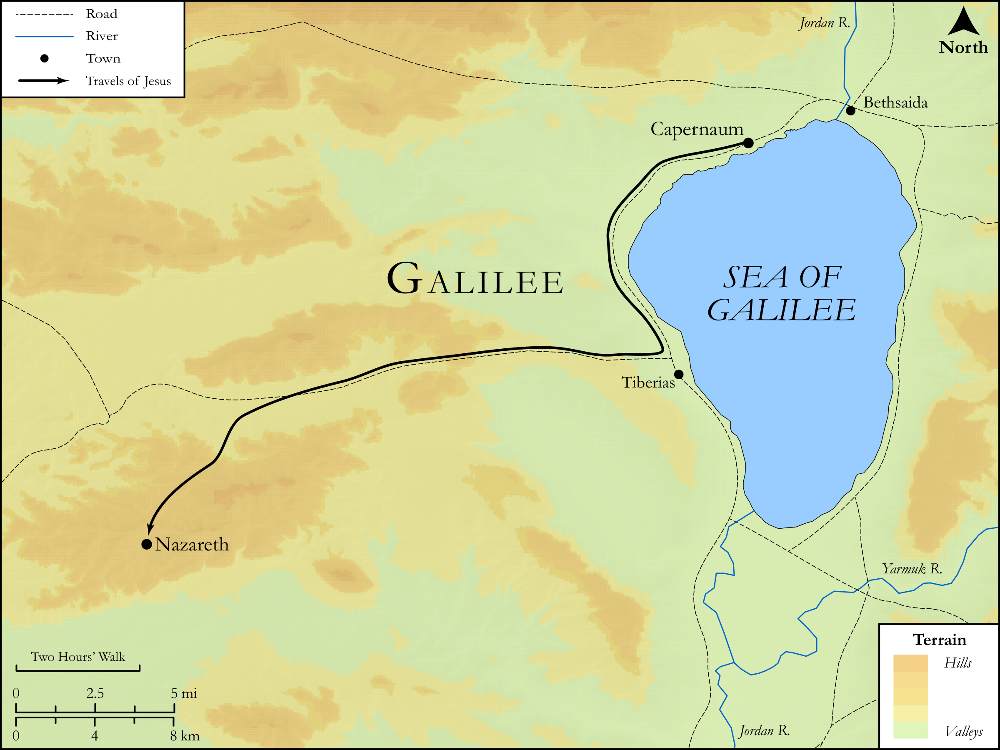

# Biblica Open Bible Maps

## License Information

Biblica Open Bible Maps, © 2023–2025 Biblica, Inc. This work is licensed under Creative Commons Attribution-ShareAlike 4.0 International (https://creativecommons.org/licenses/by-sa/4.0/). More Information: https://docs.google.com/document/d/1Pp44yZ0Zdnd59vJHTrt2rPYq0SppfX5rZbPBt6mz37U/edit?tab=t.0#heading=h.oev9aj1ksvk2

--------------------------------

## SRV Mark: Mark 6:1–6a, Mark 6:6b-13 (id: NT158)

### Image Content

[link](images/NT158.png)

Original: [SRV Mark: Mark 6:1\-6a, Mark 6:6b\-13](https://drive.google.com/open?id=1Emeu9TM3MAchaKcFZYAIUgbZI1USdkF2&usp=drive_copy)

* **Associated Passages:** Mark 6:1-56

* **Associated ACAI Concepts:** Herod Antipas (ID: `person:Herod.2`); John (ID: `person:John`); Be a Disciple (ID: `keyterm:Disciple`); Ability (ID: `keyterm:Ability`); Ship (ID: `realia:Ship`); Herodias (ID: `person:Herodias`); Baptism (ID: `keyterm:Baptism`); Resurrection (ID: `keyterm:Resurrection`); Fear (ID: `keyterm:Fear`); Serve (ID: `keyterm:Serve`); Jesus (ID: `person:Jesus.2`); Fish (ID: `fauna:Fish`); Affection (ID: `keyterm:Affection`); Joseph (ID: `person:Joseph.3`); Disbelieve (ID: `keyterm:Disbelieve`); Philip (ID: `person:Philip.2`); Gennesaret (ID: `place:Gennesaret`); Jude (ID: `person:Jude`); Daughter of Herodias (ID: `person:DaughterOfHerodias`); Bethsaida (ID: `place:Bethsaida`); Simon (ID: `person:Simon.3`); Plate (ID: `realia:Plate.2`); Haste (ID: `keyterm:Haste`); Bless (ID: `keyterm:Bless`); Cheer Up (ID: `keyterm:CheerUp`); Galilee (ID: `place:Galilee`); Baptist (ID: `keyterm:Baptist`); Ask for (ID: `keyterm:AskFor`); Salvation (ID: `keyterm:Salvation`); Kingdom (ID: `keyterm:Kingdom`)
