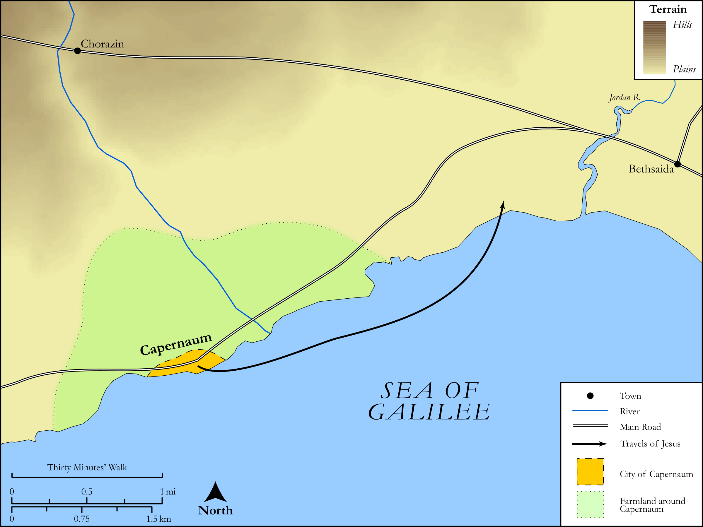

# Biblica Open Bible Maps

## License Information

Biblica Open Bible Maps, © 2023–2025 Biblica, Inc. This work is licensed under Creative Commons Attribution-ShareAlike 4.0 International (<a href="https://creativecommons.org/licenses/by-sa/4.0/">https://creativecommons.org/licenses/by-sa/4.0/</a>). More Information: <a href="https://docs.google.com/document/d/1Pp44yZ0Zdnd59vJHTrt2rPYq0SppfX5rZbPBt6mz37U/edit?tab=t.0#heading=h.oev9aj1ksvk2">https://docs.google.com/document/d/1Pp44yZ0Zdnd59vJHTrt2rPYq0SppfX5rZbPBt6mz37U/edit?tab=t.0#heading=h.oev9aj1ksvk2</a>

--------------------------------

## SRV Mark: Mark 6:30–43 (id: NT160)

### Image Content

[link](images/NT160.png)

Original: [SRV Mark: Mark 6:30\-43](https://drive.google.com/open?id=1GXTrUqTFONAW_otd3qkZsKu0Bdlw_uB1&usp=drive_copy)

* **Associated Passages:** Mark 6:1-56

* **Associated ACAI Concepts:** Herod Antipas (ID: `person:Herod.2`); John (ID: `person:John`); Be a Disciple (ID: `keyterm:Disciple`); Ability (ID: `keyterm:Ability`); Ship (ID: `realia:Ship`); Herodias (ID: `person:Herodias`); Serve (ID: `keyterm:Serve`); Jesus (ID: `person:Jesus.2`); Resurrection (ID: `keyterm:Resurrection`); Fear (ID: `keyterm:Fear`); Baptism (ID: `keyterm:Baptism`); Fish (ID: `fauna:Fish`); Jude (ID: `person:Jude`); Disbelieve (ID: `keyterm:Disbelieve`); Daughter of Herodias (ID: `person:DaughterOfHerodias`); Joseph (ID: `person:Joseph.3`); Gennesaret (ID: `place:Gennesaret`); Affection (ID: `keyterm:Affection`); Simon (ID: `person:Simon.3`); Bethsaida (ID: `place:Bethsaida`); Philip (ID: `person:Philip.2`); Plate (ID: `realia:Plate.2`); Bless (ID: `keyterm:Bless`); James (ID: `person:James.3`); Be (Or Show Oneself) Just (ID: `keyterm:Just`); Kingdom (ID: `keyterm:Kingdom`); Sky (ID: `keyterm:Heaven`); Anointed (ID: `keyterm:Anointed`); Holy (ID: `keyterm:Holy`); Elijah (ID: `person:Elijah`)
