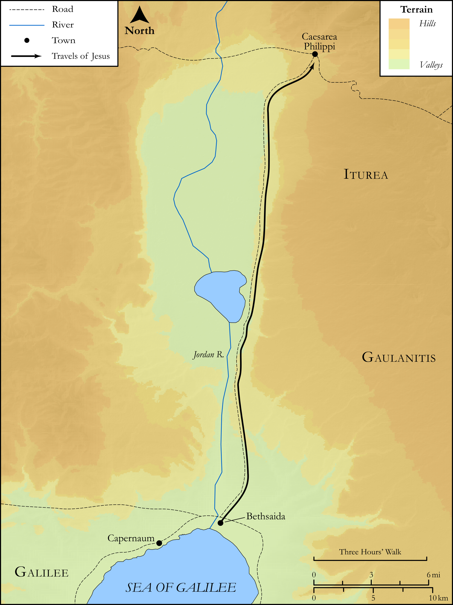

# Biblica Open Bible Maps

## License Information

Biblica Open Bible Maps, © 2023–2025 Biblica, Inc. This work is licensed under Creative Commons Attribution-ShareAlike 4.0 International (https://creativecommons.org/licenses/by-sa/4.0/). More Information: https://docs.google.com/document/d/1Pp44yZ0Zdnd59vJHTrt2rPYq0SppfX5rZbPBt6mz37U/edit?tab=t.0#heading=h.oev9aj1ksvk2

--------------------------------

## SRV Mark: Mark 8:27–30, Mark 8:31–9:0 (id: NT166)

### Image Content

[link](images/NT166.png)

Original: [SRV Mark: Mark 8:27\-30, Mark 8:31\-9:0](https://drive.google.com/open?id=18Ema2QsITIcrnDCajnasHpU1YSCR4L-Z&usp=drive_copy)

* **Associated Passages:** Mark 8:1-38

* **Associated ACAI Concepts:** Be a Disciple (ID: `keyterm:Disciple`); Peter (ID: `person:Peter`); To Command (ID: `keyterm:Command`); Life (ID: `keyterm:Life`); Basket (ID: `realia:Basket`); LORD (ID: `deity:Lord`); Ask for (ID: `keyterm:AskFor`); Jesus (ID: `person:Jesus.2`); A Group of Disciples (ID: `group:GenericDisciples`); Symbol (ID: `keyterm:Example`); Pharisees (ID: `group:Pharisee`); Baptist (ID: `keyterm:Baptist`); Caesarea Philippi (ID: `place:CaesareaPhilippi`); Bethsaida (ID: `place:Bethsaida`); Temple (ID: `realia:Temple`); House (ID: `realia:House`); Ship (ID: `realia:Ship`); Holy (ID: `keyterm:Holy`); An Angel (ID: `deity:Angel`); Herod Antipas (ID: `person:Herod.2`); Glory (ID: `keyterm:Glory`); Spirit (ID: `keyterm:Spirit.2`); Ability (ID: `keyterm:Ability`); Surely! (ID: `keyterm:Surely`); Be Unfaithful (ID: `keyterm:Unfaithful`); Salvation (ID: `keyterm:Salvation`); Elijah (ID: `person:Elijah`); Think (ID: `keyterm:Think`); Bless (ID: `keyterm:Bless`); Affection (ID: `keyterm:Affection`); Good News (ID: `keyterm:GoodNews`); Sky (ID: `keyterm:Heaven`); John (ID: `person:John`); Heart (ID: `keyterm:Heart`); Magadan (ID: `place:Magadan`); Satan (ID: `deity:Satan`); Reject (ID: `keyterm:Reject`); Cross (ID: `realia:Cross`); Fish (ID: `fauna:Fish`)
