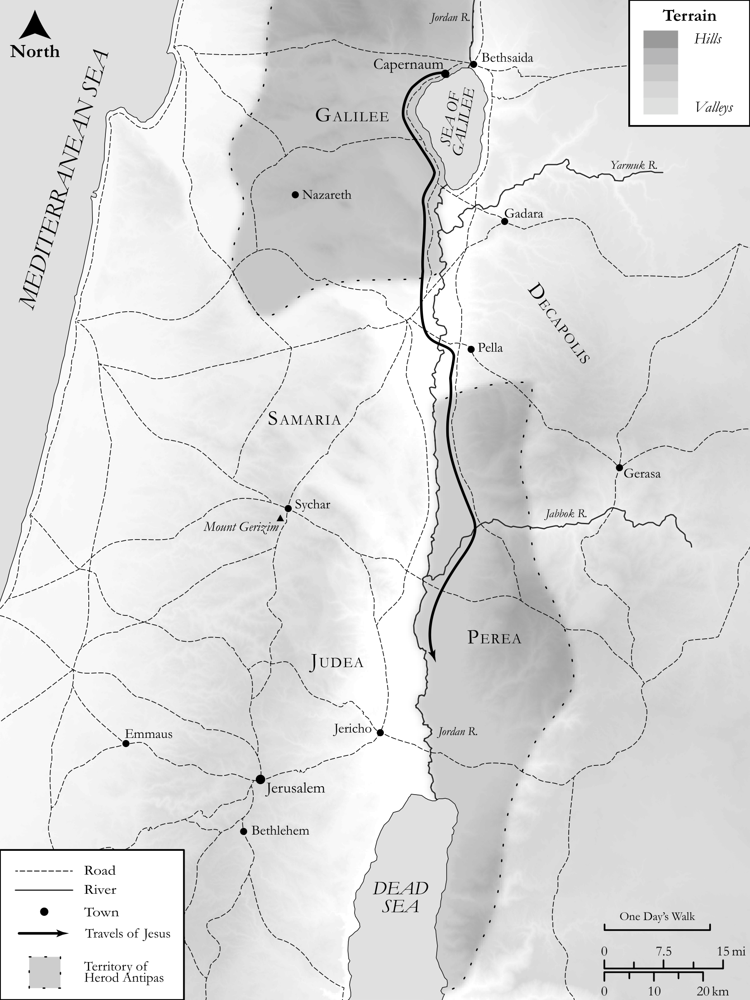

# Biblica Open Bible Maps

## License Information

Biblica Open Bible Maps, © 2023–2025 Biblica, Inc. This work is licensed under Creative Commons Attribution-ShareAlike 4.0 International (<a href="https://creativecommons.org/licenses/by-sa/4.0/">https://creativecommons.org/licenses/by-sa/4.0/</a>). More Information: <a href="https://docs.google.com/document/d/1Pp44yZ0Zdnd59vJHTrt2rPYq0SppfX5rZbPBt6mz37U/edit?tab=t.0#heading=h.oev9aj1ksvk2">https://docs.google.com/document/d/1Pp44yZ0Zdnd59vJHTrt2rPYq0SppfX5rZbPBt6mz37U/edit?tab=t.0#heading=h.oev9aj1ksvk2</a>

--------------------------------

## SRV Mark: Mark 10:1–11 (id: NT167)

### Image Content

[link](images/NT167.png)

Original: [SRV Mark: Mark 10:1\-11](https://drive.google.com/open?id=1P_KQzeUKBF0wAzLSdMtj15Uhvbjv7NCv&usp=drive_copy)

* **Associated Passages:** Mark 10:1-52

* **Associated ACAI Concepts:** Jesus (ID: `person:Jesus.2`); LORD (ID: `deity:Lord`); Kingdom (ID: `keyterm:Kingdom`); Be a Disciple (ID: `keyterm:Disciple`); To Command (ID: `keyterm:Command`); Fornication (ID: `keyterm:Fornication`); Life (ID: `keyterm:Life`); James (ID: `person:James`); Moses (ID: `person:Moses`); Commandment (ID: `keyterm:Commandment`); Surely! (ID: `keyterm:Surely`); Gentiles (ID: `group:Gentile`); John (ID: `person:John.2`); Jerusalem (ID: `place:Jerusalem`); Always (ID: `keyterm:Always`); David (ID: `person:David`); Mercy (ID: `keyterm:Mercy`); Salvation (ID: `keyterm:Salvation`); A Group of People (ID: `group:GenericGroup`); Rich Young Ruler (ID: `person:RichYoungRuler`); Good (ID: `keyterm:Good`); Baptism (ID: `keyterm:Baptism`); House (ID: `realia:House`); Bartimaeus (ID: `person:Bartimaeus`); Timaeus (ID: `person:Timaeus`); Judea (ID: `place:Judea`); Serve (ID: `keyterm:Serve`); Ability (ID: `keyterm:Ability`); Ransom (ID: `keyterm:Ransom`); Bless (ID: `keyterm:Bless`)
