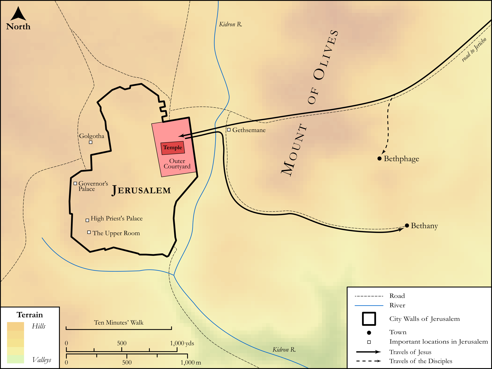

# Biblica Open Bible Maps

## License Information

Biblica Open Bible Maps, © 2023–2025 Biblica, Inc. This work is licensed under Creative Commons Attribution-ShareAlike 4.0 International (https://creativecommons.org/licenses/by-sa/4.0/). More Information: https://docs.google.com/document/d/1Pp44yZ0Zdnd59vJHTrt2rPYq0SppfX5rZbPBt6mz37U/edit?tab=t.0#heading=h.oev9aj1ksvk2

--------------------------------

## SRV Mark: Mark 11:1–11 (id: NT169)

### Image Content

[link](images/NT169.png)

Original: [SRV Mark: Mark 11:1\-11](https://drive.google.com/open?id=19TbTg-OOIY3oMsQ9T8y6G0EjKksCsH2z&usp=drive_copy)

* **Associated Passages:** Mark 11:1-33

* **Associated ACAI Concepts:** Jesus (ID: `person:Jesus.2`); Temple (ID: `realia:Temple`); Jerusalem (ID: `place:Jerusalem`); Believe (ID: `keyterm:Believe`); Bethany (ID: `place:Bethany`); Donkey (ID: `fauna:Donkey`); LORD (ID: `deity:Lord`); Ability (ID: `keyterm:Ability`); Authority (ID: `keyterm:Authority.2`); Pray (ID: `keyterm:Pray`); Sky (ID: `keyterm:Heaven`); Hosanna (ID: `keyterm:Hosanna`); Fig (ID: `flora:Fig`); Bless (ID: `keyterm:Bless`); Be a Disciple (ID: `keyterm:Disciple`); A Group of People (ID: `group:GenericGroup`); John (ID: `person:John`); Fear (ID: `keyterm:Fear`); Bethphage (ID: `place:Bethphage`); Cloak (ID: `realia:Cloak`); Baptism (ID: `keyterm:Baptism`); Forgive (ID: `keyterm:Forgive`); Religious Officials (ID: `group:ReligiousOfficials`); Always (ID: `keyterm:Always`); Peter (ID: `person:Peter`); Kingdom (ID: `keyterm:Kingdom`); Discern (ID: `keyterm:Discern`); Elders (ID: `group:GenericElders`); Surely! (ID: `keyterm:Surely`); Priests (ID: `group:GenericPriests`); Height (ID: `keyterm:Height`); David (ID: `person:David`); Heart (ID: `keyterm:Heart`); Name (ID: `keyterm:Name`); Seat (ID: `realia:Seat`); Rush (ID: `flora:Rush`); Dove (ID: `fauna:Dove`); Olive Tree (ID: `flora:OliveTree`); House (ID: `realia:House`)
