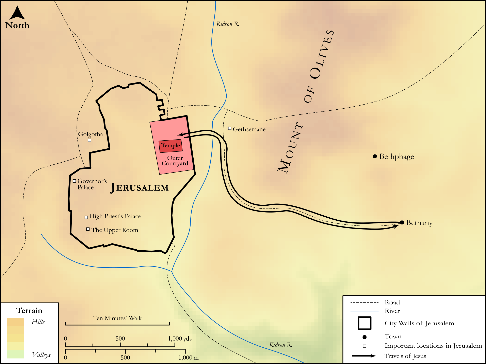

# Biblica Open Bible Maps

## License Information

Biblica Open Bible Maps, © 2023–2025 Biblica, Inc. This work is licensed under Creative Commons Attribution-ShareAlike 4.0 International (<a href="https://creativecommons.org/licenses/by-sa/4.0/">https://creativecommons.org/licenses/by-sa/4.0/</a>). More Information: <a href="https://docs.google.com/document/d/1Pp44yZ0Zdnd59vJHTrt2rPYq0SppfX5rZbPBt6mz37U/edit?tab=t.0#heading=h.oev9aj1ksvk2">https://docs.google.com/document/d/1Pp44yZ0Zdnd59vJHTrt2rPYq0SppfX5rZbPBt6mz37U/edit?tab=t.0#heading=h.oev9aj1ksvk2</a>

--------------------------------

## SRV Mark: Mark 11:12–26, Mark 11:27–33 (id: NT170)

### Image Content

[link](images/NT170.png)

Original: [SRV Mark: Mark 11:12\-26, Mark 11:27\-33](https://drive.google.com/open?id=1JyvHyVsGXdvU3cN_3Pd10NJH6H5GJbMM&usp=drive_copy)

* **Associated Passages:** Matthew 26:1-75

* **Associated ACAI Concepts:** Jesus (ID: `person:Jesus.2`); Be a Disciple (ID: `keyterm:Disciple`); Peter (ID: `person:Peter`); LORD (ID: `deity:Lord`); Pray (ID: `keyterm:Pray`); Passover (ID: `keyterm:Passover`); Judas (ID: `person:Judas.2`); Body (ID: `keyterm:Body.3`); Surely! (ID: `keyterm:Surely`); To Cause to Happen (ID: `keyterm:Happen`); Caiaphas (ID: `person:Caiaphas`); Ability (ID: `keyterm:Ability`); Galilee (ID: `place:Galilee`); Written (ID: `keyterm:Scripture`); Rooster (ID: `fauna:Rooster`); Courtyard (ID: `realia:Courtyard`); Simon (ID: `person:Simon.4`); Bethany (ID: `place:Bethany`); Gethsemane (ID: `place:Gethsemane`); Blood (ID: `keyterm:Blood`); Spirit (ID: `keyterm:Spirit.2`); Blaspheme (ID: `keyterm:Blaspheme`); Disaster (ID: `keyterm:Disaster`); Put to the Test (ID: `keyterm:PutToTheTest`); Witness (ID: `keyterm:Witness`); Bless (ID: `keyterm:Bless`); A Servant (ID: `person:GenericServant`); Kingdom (ID: `keyterm:Kingdom`); Covenant (ID: `keyterm:Covenant`); An Angel (ID: `deity:Angel`)
