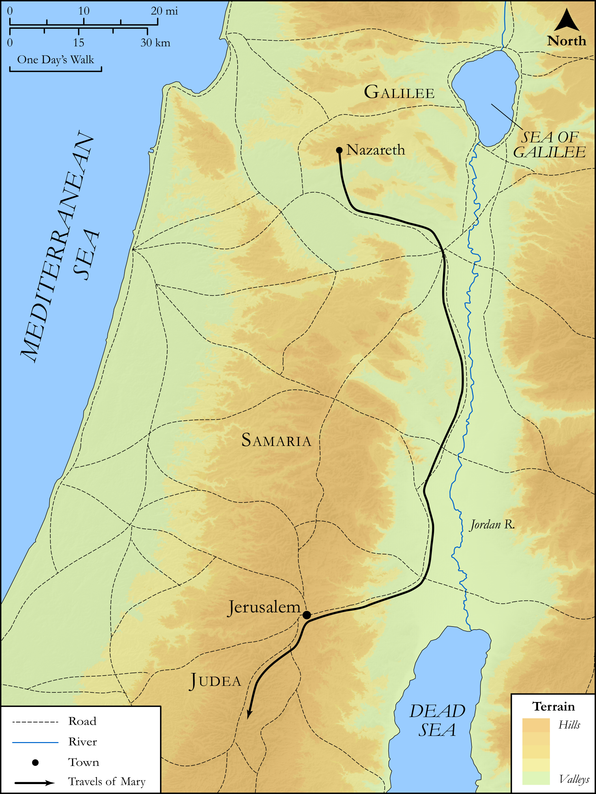

# Biblica Open Bible Maps

## License Information

Biblica Open Bible Maps, © 2023–2025 Biblica, Inc. This work is licensed under Creative Commons Attribution-ShareAlike 4.0 International (https://creativecommons.org/licenses/by-sa/4.0/). More Information: https://docs.google.com/document/d/1Pp44yZ0Zdnd59vJHTrt2rPYq0SppfX5rZbPBt6mz37U/edit?tab=t.0#heading=h.oev9aj1ksvk2

--------------------------------

## SRV Luke: Luke 1:39–55 (id: NT201)

### Image Content

[link](images/NT201.png)

Original: [SRV Luke: Luke 1:39\-55](https://drive.google.com/open?id=1hnUhIf7XfOp1CSX9kDatikYQT074l2cv&usp=drive_copy)

* **Associated Passages:** Luke 1:1-80

* **Associated ACAI Concepts:** LORD (ID: `deity:Lord`); Name (ID: `keyterm:Name`); Elizabeth (ID: `person:Elizabeth`); Zechariah (ID: `person:Zechariah`); An Angel (ID: `deity:Angel`); Mary (ID: `person:Mary`); Holy Spirit (ID: `deity:HolySpirit`); Fear (ID: `keyterm:Fear`); Israel (ID: `person:Israel`); Holy (ID: `keyterm:Holy`); Mercy (ID: `keyterm:Mercy`); Temple (ID: `realia:Temple`); Priesthood (ID: `keyterm:Priesthood`); Word (ID: `keyterm:Word`); Bless (ID: `keyterm:Bless`); Spirit (ID: `keyterm:Spirit.2`); Salvation (ID: `keyterm:Salvation`); David (ID: `person:David`); John (ID: `person:John`); Be (Or Show Oneself) Just (ID: `keyterm:Just`); Heart (ID: `keyterm:Heart`); Always (ID: `keyterm:Always`); Gabriel (ID: `deity:Gabriel`); Jesus (ID: `person:Jesus.2`); Favor (ID: `keyterm:Favor`); Judea (ID: `place:Judea`); Believe (ID: `keyterm:Believe`); Abraham (ID: `person:Abraham`); Pray (ID: `keyterm:Pray`); Ability (ID: `keyterm:Ability`)
