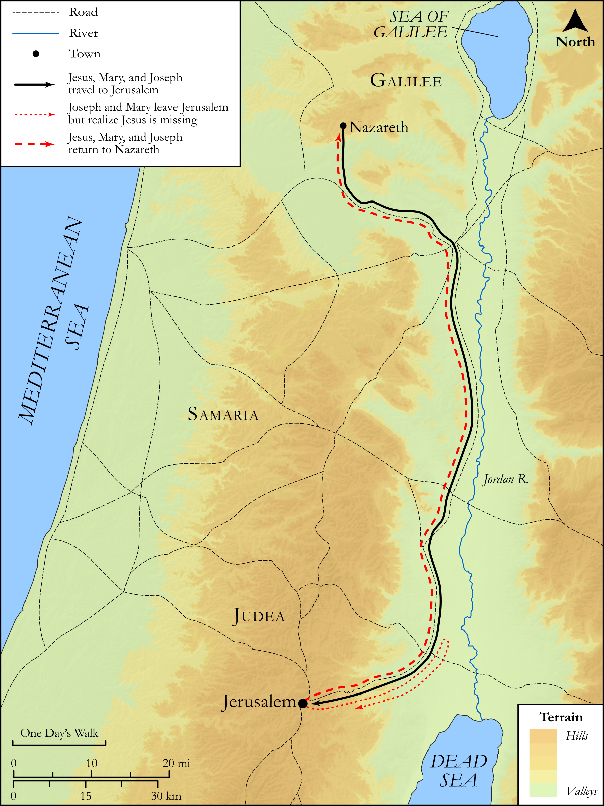

# Biblica Open Bible Maps

## License Information

Biblica Open Bible Maps, © 2023–2025 Biblica, Inc. This work is licensed under Creative Commons Attribution-ShareAlike 4.0 International (https://creativecommons.org/licenses/by-sa/4.0/). More Information: https://docs.google.com/document/d/1Pp44yZ0Zdnd59vJHTrt2rPYq0SppfX5rZbPBt6mz37U/edit?tab=t.0#heading=h.oev9aj1ksvk2

--------------------------------

## SRV Luke: Luke 2:41–51 (id: NT204)

### Image Content

[link](images/NT204.png)

Original: [SRV Luke: Luke 2:41\-51](https://drive.google.com/open?id=1HggmPEm6SWwr5TDhG0GFO0MoD1kp9vRW&usp=drive_copy)

* **Associated Passages:** Luke 2:1-52

* **Associated ACAI Concepts:** LORD (ID: `deity:Lord`); Jerusalem (ID: `place:Jerusalem`); Word (ID: `keyterm:Word`); Jesus (ID: `person:Jesus.2`); Law (ID: `keyterm:Law`); An Angel (ID: `deity:Angel`); Glory (ID: `keyterm:Glory`); Mary (ID: `person:Mary`); Nazareth (ID: `place:Nazareth`); Register (ID: `keyterm:Register`); Holy Spirit (ID: `deity:HolySpirit`); Heart (ID: `keyterm:Heart`); Israel (ID: `person:Israel`); Sheep (ID: `fauna:Lamb`); Flock (ID: `fauna:Flock`); Goat (ID: `fauna:Goat`); Simeon (ID: `person:Simeon.2`); Bethlehem (ID: `place:Bethlehem`); Manger (ID: `realia:Manger`); Bless (ID: `keyterm:Bless`); Galilee (ID: `place:Galilee`); Favor (ID: `keyterm:Favor`); David (ID: `person:David`); Make Peace (ID: `keyterm:Peace`); Name (ID: `keyterm:Name`); Fear (ID: `keyterm:Fear`); Joseph (ID: `person:Joseph.4`); Symbol (ID: `keyterm:Example`); Holy (ID: `keyterm:Holy`); Temple (ID: `realia:Temple`)
