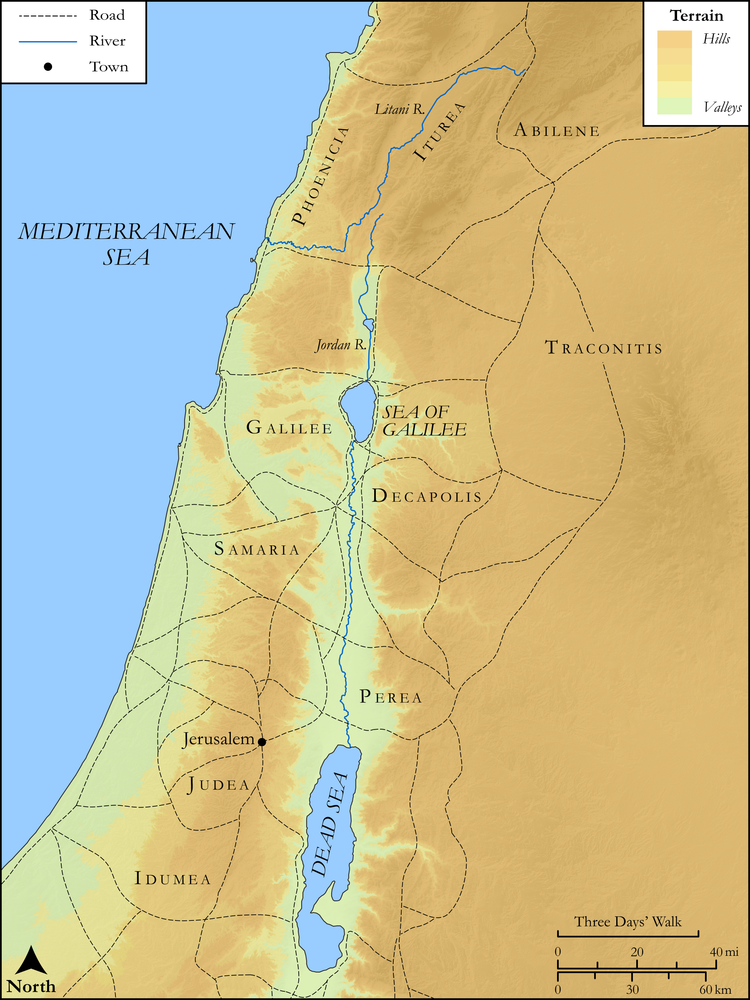

# Biblica Open Bible Maps

## License Information

Biblica Open Bible Maps, © 2023–2025 Biblica, Inc. This work is licensed under Creative Commons Attribution-ShareAlike 4.0 International (https://creativecommons.org/licenses/by-sa/4.0/). More Information: https://docs.google.com/document/d/1Pp44yZ0Zdnd59vJHTrt2rPYq0SppfX5rZbPBt6mz37U/edit?tab=t.0#heading=h.oev9aj1ksvk2

--------------------------------

## SRV Luke: Luke 3:1–13 (id: NT205)

### Image Content

[link](images/NT205.png)

Original: [SRV Luke: Luke 3:1\-13](https://drive.google.com/open?id=1PLMkF4mbD3u1s7S3Ys7BoEra6sAzNz50&usp=drive_copy)

* **Associated Passages:** Luke 3:1-38

* **Associated ACAI Concepts:** Baptism (ID: `keyterm:Baptism`); LORD (ID: `deity:Lord`); John (ID: `person:John`); Jesus (ID: `person:Jesus.2`); Herod Antipas (ID: `person:Herod.2`); Sky (ID: `keyterm:Heaven`); Abraham (ID: `person:Abraham`); Holy Spirit (ID: `deity:HolySpirit`); Repent (ID: `keyterm:Repent`); Straightness (ID: `keyterm:Straightness`); Shelah (ID: `person:Shelah.2`); Matthat (ID: `person:Matthat`); Joseph (ID: `person:Joseph.8`); Matthat (ID: `person:Matthat.2`); Rhesa (ID: `person:Rhesa`); Jordan River (ID: `place:Jordan`); Kenan (ID: `person:Kenan`); Terah (ID: `person:Terah`); Levi (ID: `person:Levi`); Cainan (ID: `person:Cainan`); Mattathias (ID: `person:Mattathias`); Eliakim (ID: `person:Eliakim.2`); Zerubbabel (ID: `person:Zerubbabel`); Adam (ID: `person:Adam`); Joseph (ID: `person:Joseph.4`); Jannai (ID: `person:Jannai`); Nahor (ID: `person:Nahor`); Lysanias (ID: `person:Lysanias`); Boaz (ID: `person:Boaz`); Joshua (ID: `person:Joshua`); Trachonitis (ID: `place:Trachonitis`); Jorim (ID: `person:Jorim`); Hezron (ID: `person:Hezron.2`); Tiberius (ID: `person:Tiberius`); Melchi (ID: `person:Melchi`); Reu (ID: `person:Reu`); Mattatha (ID: `person:Mattatha`); Simeon (ID: `person:Simeon.3`); Nahum (ID: `person:Nahum`); Herodias (ID: `person:Herodias`); Joseph (ID: `person:Joseph.7`); Enosh (ID: `person:Enosh`); Jonam (ID: `person:Jonam`); Serug (ID: `person:Serug`); Philip (ID: `person:Philip.3`); Ituraea (ID: `place:Ituraea`); Nathan (ID: `person:Nathan`); Peleg (ID: `person:Peleg`); Esli (ID: `person:Esli`); Heli (ID: `person:Heli`); Jared (ID: `person:Jared`); Lamech (ID: `person:Lamech.2`); Amos (ID: `person:Amos.2`); Neri (ID: `person:Neri`); Addi (ID: `person:Addi`); Naggai (ID: `person:Naggai`); Maath (ID: `person:Maath`); Eliezer (ID: `person:Eliezer`); Mattathias (ID: `person:Mattathias.2`); Annas (ID: `person:Annas`); Methuselah (ID: `person:Methuselah`); Shealtiel (ID: `person:Shealtiel`); Mahalalel (ID: `person:Mahalalel`); Cosam (ID: `person:Cosam`); Melchi (ID: `person:Melchi.2`); Augustus (ID: `person:Augustus`); Shem (ID: `person:Shem`); Levi (ID: `person:Levi.2`); Salmon (ID: `person:Salmon`); Seth (ID: `person:Seth`); Eber (ID: `person:Eber`); Melea (ID: `person:Melea`); Abilene (ID: `place:Abilene`); Semein (ID: `person:Semein`); Judah (ID: `person:Judah.3`); Menna (ID: `person:Menna`); Joanan (ID: `person:Joanan`); Er (ID: `person:Er`); Joda (ID: `person:Joda`); Josech (ID: `person:Josech`); Elmadam (ID: `person:Elmadam`); Ask for (ID: `keyterm:AskFor`); Salvation (ID: `keyterm:Salvation`); To Sin (ID: `keyterm:Sin`); Isaiah (ID: `person:Isaiah`); Obed (ID: `person:Obed`); Proclaim (ID: `keyterm:Proclaim`); Zechariah (ID: `person:Zechariah`); Pilate (ID: `person:Pilate`); Arpachshad (ID: `person:Arpachshad`); Judah (ID: `person:Judah.4`); Clean Out (ID: `keyterm:CleanOut`); Jesse (ID: `person:Jesse`); Beloved (ID: `keyterm:Beloved`); Perez (ID: `person:Perez`); Judea (ID: `place:Judea`); Amminadab (ID: `person:Amminadab`); Enoch (ID: `person:Enoch.2`); Body (ID: `keyterm:Body.3`); David (ID: `person:David`); Caiaphas (ID: `person:Caiaphas`); Pray (ID: `keyterm:Pray`); Forgive (ID: `keyterm:Forgive`); Heart (ID: `keyterm:Heart`); Noah (ID: `person:Noah`); Ram (ID: `person:Ram`); Galilee (ID: `place:Galilee`); Word (ID: `keyterm:Word`); Nahshon (ID: `person:Nahshon`); Isaac (ID: `person:Isaac`); Tax Collector (ID: `keyterm:TaxCollector`); Israel (ID: `person:Israel`); Strap (ID: `realia:Strap`); Axe (ID: `realia:Axe`); Sandal (ID: `realia:Sandal`); Threshing Floor (ID: `realia:ThreshingFloor`); Snake (ID: `fauna:Snake`); Winnowing Fork (ID: `realia:WinnowingFork`); Barn (ID: `realia:Barn`); Prison (ID: `realia:Prison`); Dove (ID: `fauna:Dove`); Scroll (ID: `realia:Scroll`); Wheat (ID: `flora:Wheat`); Grain (ID: `flora:Grain`); Tunic (ID: `realia:Tunic.2`)
