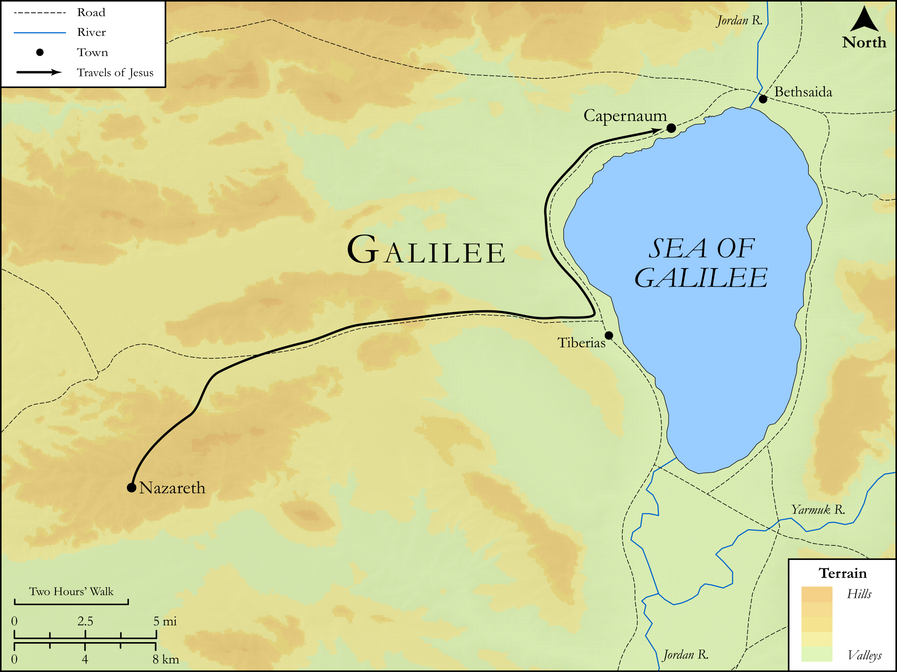

# Biblica Open Bible Maps

## License Information

Biblica Open Bible Maps, © 2023–2025 Biblica, Inc. This work is licensed under Creative Commons Attribution-ShareAlike 4.0 International (https://creativecommons.org/licenses/by-sa/4.0/). More Information: https://docs.google.com/document/d/1Pp44yZ0Zdnd59vJHTrt2rPYq0SppfX5rZbPBt6mz37U/edit?tab=t.0#heading=h.oev9aj1ksvk2

--------------------------------

## SRV Luke: Luke 4:31–43 (id: NT209)

### Image Content

[link](images/NT209.png)

Original: [SRV Luke: Luke 4:31\-43](https://drive.google.com/open?id=1Mrmz3a0lBdL77K6CGMOZrNi8-zYVje_n&usp=drive_copy)

* **Associated Passages:** Luke 4:1-44

* **Associated ACAI Concepts:** Jesus (ID: `person:Jesus.2`); LORD (ID: `deity:Lord`); To Command (ID: `keyterm:Command`); Ability (ID: `keyterm:Ability`); Synagogue (ID: `realia:Synagogue`); Serve (ID: `keyterm:Serve`); Proclaim (ID: `keyterm:Proclaim`); Put to the Test (ID: `keyterm:PutToTheTest`); Holy Spirit (ID: `deity:HolySpirit`); Authority (ID: `keyterm:Authority.2`); Demons (ID: `deity:Demons`); Galilee (ID: `place:Galilee`); Good News (ID: `keyterm:GoodNews`); Capernaum (ID: `place:Capernaum`); Nazareth (ID: `place:Nazareth`); Israel (ID: `person:Israel`); Bow Down (ID: `keyterm:BowDown`); Glory (ID: `keyterm:Glory`); Kingdom (ID: `keyterm:Kingdom`); Sabbath (ID: `keyterm:Sabbath`); Elijah (ID: `person:Elijah`); Naaman (ID: `person:Naaman.3`); Elisha (ID: `person:Elisha`); Syrians (ID: `group:Syria`); Zarephath (ID: `place:Zarephath`); Judea (ID: `place:Judea`); Scroll (ID: `realia:Scroll`); Holy (ID: `keyterm:Holy`); Ask for (ID: `keyterm:AskFor`); An Angel (ID: `deity:Angel`); Parable (ID: `keyterm:Parable`); Priesthood (ID: `keyterm:Priesthood`); Joseph (ID: `person:Joseph.4`); Peter (ID: `person:Peter`); Favor (ID: `keyterm:Favor`); Bear Witness (ID: `keyterm:BearWitness`); Protect (ID: `keyterm:Protect`); Surely! (ID: `keyterm:Surely`); Sidon (ID: `place:Sidon`); Truth (ID: `keyterm:Truth`); Written (ID: `keyterm:Scripture`); To Cause to Happen (ID: `keyterm:Happen`); Sky (ID: `keyterm:Heaven`); To Cleanse (ID: `keyterm:Cleanse.2`); Anointed (ID: `keyterm:Anointed`); Defilement (ID: `keyterm:Defilement`); Isaiah (ID: `person:Isaiah`); Life (ID: `keyterm:Life`); Jerusalem (ID: `place:Jerusalem`); Jordan River (ID: `place:Jordan`); Pinnacle (ID: `realia:Pinnacle`); House (ID: `realia:House`); Temple (ID: `realia:Temple`)
