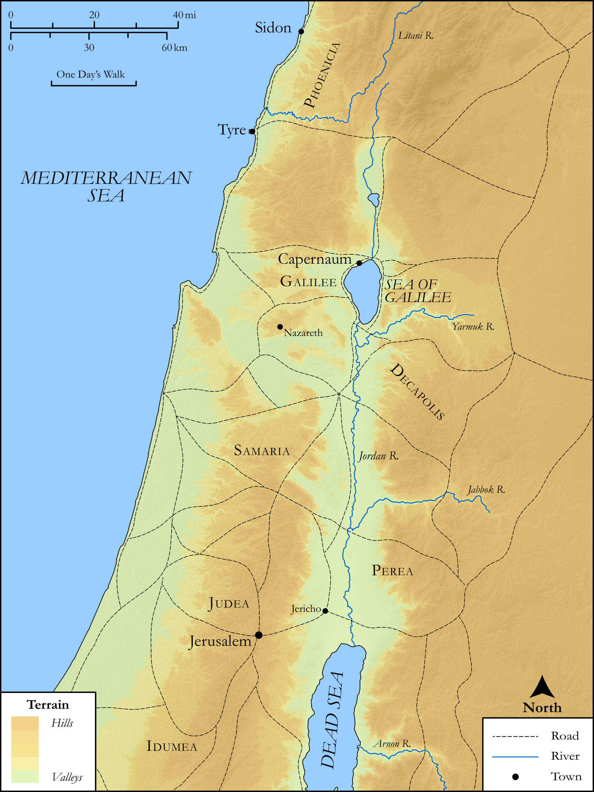

# Biblica Open Bible Maps

## License Information

Biblica Open Bible Maps, © 2023–2025 Biblica, Inc. This work is licensed under Creative Commons Attribution-ShareAlike 4.0 International (https://creativecommons.org/licenses/by-sa/4.0/). More Information: https://docs.google.com/document/d/1Pp44yZ0Zdnd59vJHTrt2rPYq0SppfX5rZbPBt6mz37U/edit?tab=t.0#heading=h.oev9aj1ksvk2

--------------------------------

## SRV Luke: Luke 6:17–18 (id: NT211)

### Image Content

[link](images/NT211.png)

Original: [SRV Luke: Luke 6:17\-18](https://drive.google.com/open?id=1On0IAgByfFjvlKB-g2RLy_tdf5r2Q27Q&usp=drive_copy)

* **Associated Passages:** Luke 6:1-49

* **Associated ACAI Concepts:** Sabbath (ID: `keyterm:Sabbath`); LORD (ID: `deity:Lord`); Be a Disciple (ID: `keyterm:Disciple`); Happy (ID: `keyterm:Happy`); Do Good (ID: `keyterm:DoGood`); Jesus (ID: `person:Jesus.2`); Favor (ID: `keyterm:Favor`); Be Lawful (ID: `keyterm:Lawful`); Disaster (ID: `keyterm:Disaster`); Love (ID: `keyterm:Love`); Good (ID: `keyterm:Good`); Serve (ID: `keyterm:Serve`); Pray (ID: `keyterm:Pray`); James (ID: `person:James.2`); Pharisees (ID: `group:Pharisee`); House (ID: `realia:House`); Condemn (ID: `keyterm:Condemn`); Simon (ID: `person:Simon.2`); Judas (ID: `person:Judas`); Chosen (ID: `keyterm:Chosen`); Matthew (ID: `person:Matthew`); Compassionate (ID: `keyterm:Compassionate`); Andrew (ID: `person:Andrew`); Judas (ID: `person:Judas.2`); Philip (ID: `person:Philip`); Ask for (ID: `keyterm:AskFor`); Forgive (ID: `keyterm:Forgive`); Parable (ID: `keyterm:Parable`); Hope (ID: `keyterm:Hope`); Thomas (ID: `person:Thomas`); Peter (ID: `person:Peter`); Ability (ID: `keyterm:Ability`); Kingdom (ID: `keyterm:Kingdom`); Bartholomew (ID: `person:Bartholomew`); Sidon (ID: `place:Sidon`); Salvation (ID: `keyterm:Salvation`); Alphaeus (ID: `person:Alphaeus`); David (ID: `person:David`); Tyre (ID: `place:Tyre`); Bless (ID: `keyterm:Bless`); Sky (ID: `keyterm:Heaven`); Heart (ID: `keyterm:Heart`); Name (ID: `keyterm:Name`); James (ID: `person:James`); John (ID: `person:John.2`); Life (ID: `keyterm:Life`); Jerusalem (ID: `place:Jerusalem`); Decided (ID: `keyterm:Decided`); Judea (ID: `place:Judea`); Beam (ID: `realia:Beam`); Foundation (ID: `realia:Foundation`); Cloak (ID: `realia:Cloak`); Storeroom (ID: `realia:Storeroom`); Vine (ID: `flora:Vine`); Grain (ID: `flora:Grain`); Tunic (ID: `realia:Tunic.2`); Brier (ID: `flora:Brier`); Acacia (ID: `flora:Acacia`); Fig (ID: `flora:Fig`); Boxthorn (ID: `flora:Boxthorn`); Thistle (ID: `flora:Thistle`); Wheat (ID: `flora:Wheat`); Temple (ID: `realia:Temple`); Synagogue (ID: `realia:Synagogue`)
