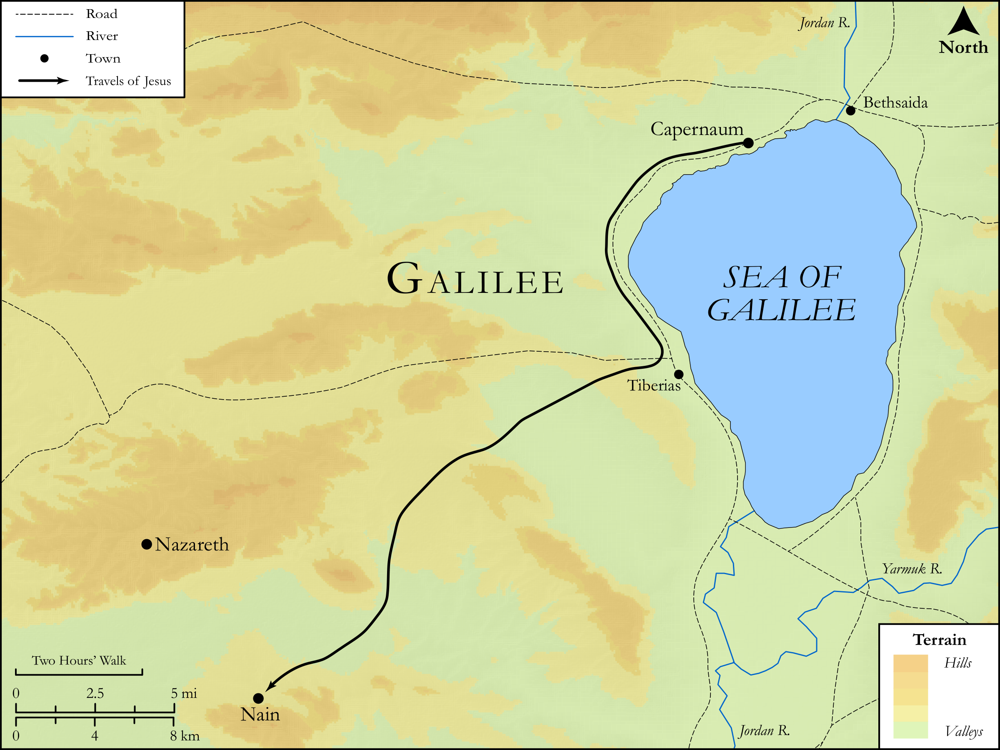

# Biblica Open Bible Maps

## License Information

Biblica Open Bible Maps, © 2023–2025 Biblica, Inc. This work is licensed under Creative Commons Attribution-ShareAlike 4.0 International (<a href="https://creativecommons.org/licenses/by-sa/4.0/">https://creativecommons.org/licenses/by-sa/4.0/</a>). More Information: <a href="https://docs.google.com/document/d/1Pp44yZ0Zdnd59vJHTrt2rPYq0SppfX5rZbPBt6mz37U/edit?tab=t.0#heading=h.oev9aj1ksvk2">https://docs.google.com/document/d/1Pp44yZ0Zdnd59vJHTrt2rPYq0SppfX5rZbPBt6mz37U/edit?tab=t.0#heading=h.oev9aj1ksvk2</a>

--------------------------------

## SRV Luke: Luke 7:11–16 (id: NT213)

### Image Content

[link](images/NT213.png)

Original: [SRV Luke: Luke 7:11\-16](https://drive.google.com/open?id=1hc3L2KYNkq3Sa0_O-GLtnDKbDEkoBO2j&usp=drive_copy)

* **Associated Passages:** Luke 7:1-50

* **Associated ACAI Concepts:** Jesus (ID: `person:Jesus.2`); John (ID: `person:John`); Forgive (ID: `keyterm:Forgive`); LORD (ID: `deity:Lord`); Pharisees (ID: `group:Pharisee`); House (ID: `realia:House`); Simon (ID: `person:Simon.6`); Ask for (ID: `keyterm:AskFor`); To Sin (ID: `keyterm:Sin`); Love (ID: `keyterm:Love`); Baptist (ID: `keyterm:Baptist`); Be a Disciple (ID: `keyterm:Disciple`); Tax Collector (ID: `keyterm:TaxCollector`); An Angel (ID: `deity:Angel`); Anointed (ID: `keyterm:Anointed`); Salvation (ID: `keyterm:Salvation`); Believe (ID: `keyterm:Believe`); Baptism (ID: `keyterm:Baptism`); Myrrh (ID: `flora:Myrrh`); Temple (ID: `realia:Temple`); Myrrh (ID: `realia:Myrrh`); Owe (ID: `keyterm:Owe`); Nain (ID: `place:Nain`); Judea (ID: `place:Judea`); Decided (ID: `keyterm:Decided`); Ability (ID: `keyterm:Ability`); Serve (ID: `keyterm:Serve`); Good News (ID: `keyterm:GoodNews`); Capernaum (ID: `place:Capernaum`); Make Peace (ID: `keyterm:Peace`); Glorious (ID: `keyterm:Glorious`); To Command (ID: `keyterm:Command`); Be (Or Show Oneself) Just (ID: `keyterm:Just`); Jews (ID: `group:Jews`); Kingdom (ID: `keyterm:Kingdom`); Glory (ID: `keyterm:Glory`); Fear (ID: `keyterm:Fear`); Resurrection (ID: `keyterm:Resurrection`); Happy (ID: `keyterm:Happy`); Obey Righteous Commands (ID: `keyterm:ObeyRighteousCommands`); Word (ID: `keyterm:Word`); A Group of People (ID: `group:GenericGroup`); Affection (ID: `keyterm:Affection`); To Cleanse (ID: `keyterm:Cleanse.2`); A Group of Disciples (ID: `group:GenericDisciples`); Authority (ID: `keyterm:Authority.2`); Israel (ID: `person:Israel`); Demons (ID: `deity:Demons`); Alabaster Jar (ID: `realia:AlabasterJar`); Wine (ID: `realia:Wine`); Housetop (ID: `realia:Housetop`); Flute (ID: `realia:Flute`); Clothing (ID: `realia:Clothing`); Palace (ID: `realia:Palace`); Olive Oil (ID: `realia:OliveOil`); Denarius (ID: `realia:Denarius`); Reed (ID: `flora:Reed`); Synagogue (ID: `realia:Synagogue`); Bier (ID: `realia:Bier`)
