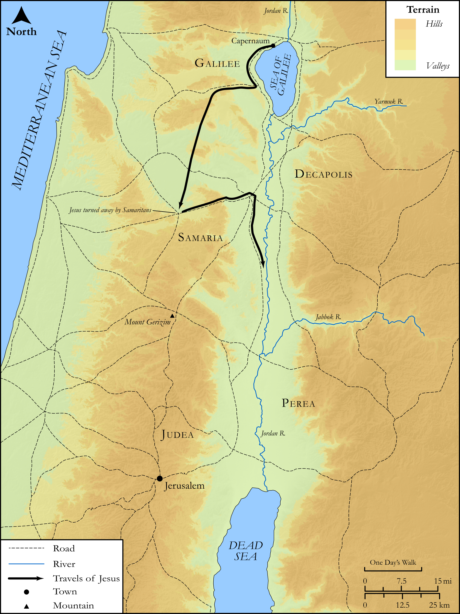

# Biblica Open Bible Maps

## License Information

Biblica Open Bible Maps, © 2023–2025 Biblica, Inc. This work is licensed under Creative Commons Attribution-ShareAlike 4.0 International (https://creativecommons.org/licenses/by-sa/4.0/). More Information: https://docs.google.com/document/d/1Pp44yZ0Zdnd59vJHTrt2rPYq0SppfX5rZbPBt6mz37U/edit?tab=t.0#heading=h.oev9aj1ksvk2

--------------------------------

## SRV Luke: Luke 9:46–61 (id: NT219)

### Image Content

[link](images/NT219.png)

Original: [SRV Luke: Luke 9:46\-61](https://drive.google.com/open?id=1505Dd8vadshGXk5Gbu_D33v-aPwmFtWq&usp=drive_copy)

* **Associated Passages:** Luke 9:1-62

* **Associated ACAI Concepts:** Jesus (ID: `person:Jesus.2`); LORD (ID: `deity:Lord`); Be a Disciple (ID: `keyterm:Disciple`); Kingdom (ID: `keyterm:Kingdom`); Peter (ID: `person:Peter`); Elijah (ID: `person:Elijah`); Glory (ID: `keyterm:Glory`); Pray (ID: `keyterm:Pray`); Demons (ID: `deity:Demons`); To Command (ID: `keyterm:Command`); John (ID: `person:John`); Sky (ID: `keyterm:Heaven`); John (ID: `person:John.2`); Jerusalem (ID: `place:Jerusalem`); Herod Antipas (ID: `person:Herod.2`); An Angel (ID: `deity:Angel`); A Group of Disciples (ID: `group:GenericDisciples`); Ability (ID: `keyterm:Ability`); Serve (ID: `keyterm:Serve`); Moses (ID: `person:Moses`); Resurrection (ID: `keyterm:Resurrection`); Name (ID: `keyterm:Name`); Fear (ID: `keyterm:Fear`); James (ID: `person:James`); Samaritans (ID: `group:Samaritan`); Reject (ID: `keyterm:Reject`); Religious Official (ID: `person:ReligiousOfficial`); Word (ID: `keyterm:Word`); Holy (ID: `keyterm:Holy`); Ask for (ID: `keyterm:AskFor`)
