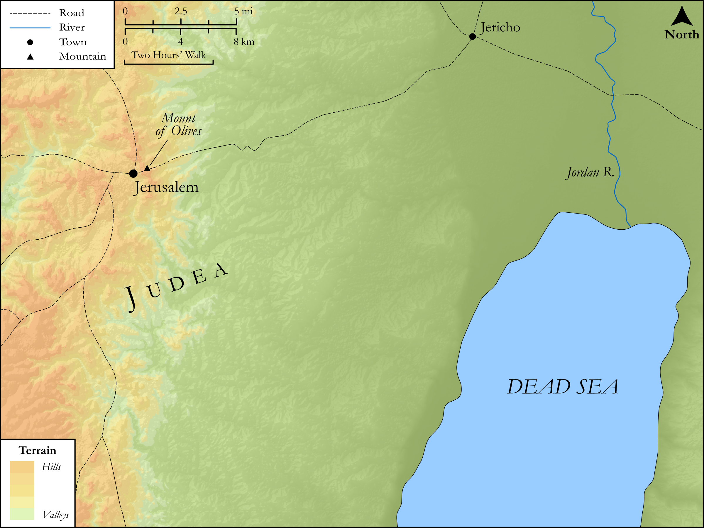

# Biblica Open Bible Maps

## License Information

Biblica Open Bible Maps, © 2023–2025 Biblica, Inc. This work is licensed under Creative Commons Attribution-ShareAlike 4.0 International (https://creativecommons.org/licenses/by-sa/4.0/). More Information: https://docs.google.com/document/d/1Pp44yZ0Zdnd59vJHTrt2rPYq0SppfX5rZbPBt6mz37U/edit?tab=t.0#heading=h.oev9aj1ksvk2

--------------------------------

## SRV Luke: Luke 10:25–36 (id: NT220)

### Image Content

[link](images/NT220.png)

Original: [SRV Luke: Luke 10:25\-36](https://drive.google.com/open?id=1NGsYmkegEpGkga1MHwkDI1dsppllxRlZ&usp=drive_copy)

* **Associated Passages:** Luke 10:1-42

* **Associated ACAI Concepts:** Jesus (ID: `person:Jesus.2`); LORD (ID: `deity:Lord`); Sky (ID: `keyterm:Heaven`); Martha (ID: `person:Martha`); A Priest (ID: `person:GenericPriest`); A Scribe (ID: `person:Scribe`); Name (ID: `keyterm:Name`); Make Peace (ID: `keyterm:Peace`); Mary (ID: `person:Mary.3`); Kingdom (ID: `keyterm:Kingdom`); Life (ID: `keyterm:Life`); Ability (ID: `keyterm:Ability`); Tyre (ID: `place:Tyre`); Serve (ID: `keyterm:Serve`); Sidon (ID: `place:Sidon`); Inn (ID: `realia:Inn`); Disaster (ID: `keyterm:Disaster`); Chorazin (ID: `place:Chorazin`); Mercy (ID: `keyterm:Mercy`); Mind (ID: `keyterm:Mind.2`); House (ID: `realia:House`); Affection (ID: `keyterm:Affection`); Satan (ID: `deity:Satan`); Jericho (ID: `place:Jericho`); Levi (ID: `person:Levi.3`); Love (ID: `keyterm:Love`); Jerusalem (ID: `place:Jerusalem`); Law (ID: `keyterm:Law`); Ask for (ID: `keyterm:AskFor`); Happy (ID: `keyterm:Happy`); Chosen (ID: `keyterm:Chosen`); Judgment (ID: `keyterm:Judgment`); Cause of Joy (ID: `keyterm:CauseOfJoy`); Authority (ID: `keyterm:Authority.2`); Holy Spirit (ID: `deity:HolySpirit`); Good (ID: `keyterm:Good`); Repent (ID: `keyterm:Repent`); Capernaum (ID: `place:Capernaum`); World of the Dead (ID: `keyterm:WorldOfTheDead`); Demons (ID: `deity:Demons`); Be (Or Show Oneself) Just (ID: `keyterm:Just`); To Command (ID: `keyterm:Command`); Sodom (ID: `place:Sodom`); Samaria (ID: `place:Samaria`); Tribe of Levi (ID: `group:Levi`); Heart (ID: `keyterm:Heart`); Hell (ID: `place:Hell`); To Act Wickedly (ID: `keyterm:ActWickedly`); Be a Disciple (ID: `keyterm:Disciple`); Court Case (ID: `keyterm:CourtCase`); Always (ID: `keyterm:Always`); Bethsaida (ID: `place:Bethsaida`); Samaritans (ID: `group:Samaritan`); Scorpion (ID: `fauna:Scorpion`); Wine (ID: `realia:Wine`); Snake (ID: `fauna:Snake`); Sheep (ID: `fauna:Lamb`); Bag (ID: `realia:Bag`); Sandal (ID: `realia:Sandal`); Wolf (ID: `fauna:Wolf`); Olive Oil (ID: `realia:OliveOil`); Sackcloth (ID: `realia:Sackcloth`); Denarius (ID: `realia:Denarius`)
