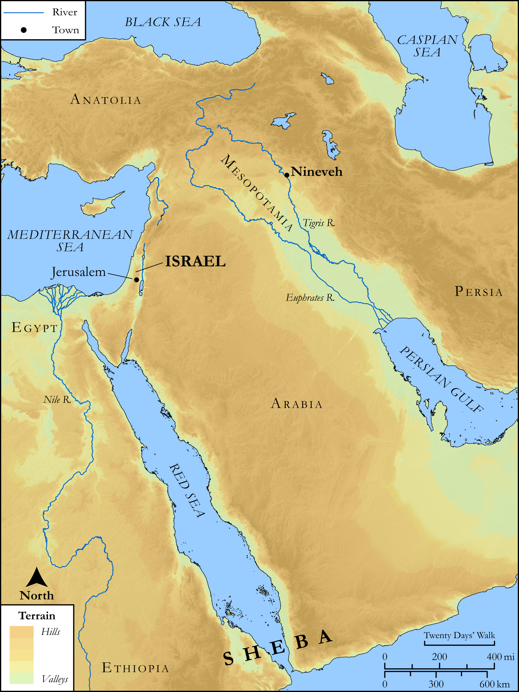

# Biblica Open Bible Maps

## License Information

Biblica Open Bible Maps, © 2023–2025 Biblica, Inc. This work is licensed under Creative Commons Attribution-ShareAlike 4.0 International (https://creativecommons.org/licenses/by-sa/4.0/). More Information: https://docs.google.com/document/d/1Pp44yZ0Zdnd59vJHTrt2rPYq0SppfX5rZbPBt6mz37U/edit?tab=t.0#heading=h.oev9aj1ksvk2

--------------------------------

## SRV Luke: Luke 11:14–31 (id: NT222)

### Image Content

[link](images/NT222.png)

Original: [SRV Luke: Luke 11:14\-31](https://drive.google.com/open?id=1oWrjsTfHMfcWNqBMaEo6U9D695hHCV7f&usp=drive_copy)

* **Associated Passages:** Luke 11:1-54

* **Associated ACAI Concepts:** LORD (ID: `deity:Lord`); Disaster (ID: `keyterm:Disaster`); Pharisees (ID: `group:Pharisee`); Demons (ID: `deity:Demons`); Kingdom (ID: `keyterm:Kingdom`); Satan (ID: `deity:Satan`); Judgment (ID: `keyterm:Judgment`); Jonah (ID: `person:Jonah.2`); Symbol (ID: `keyterm:Example`); Ninevites (ID: `group:Nineveh`); Pray (ID: `keyterm:Pray`); Love (ID: `keyterm:Love`); Happy (ID: `keyterm:Happy`); Nineveh (ID: `place:Nineveh`); Sky (ID: `keyterm:Heaven`); Court Case (ID: `keyterm:CourtCase`); Blood (ID: `keyterm:Blood`); Body (ID: `keyterm:Body.3`); House (ID: `realia:House`); Temple (ID: `realia:Temple`); Zechariah (ID: `person:Zechariah.12`); Persuade (ID: `keyterm:Persuade`); Ask for (ID: `keyterm:AskFor`); To Sin (ID: `keyterm:Sin`); A Group of People (ID: `group:GenericGroup`); Proclaim (ID: `keyterm:Proclaim`); Abel (ID: `person:Abel`); Holy Spirit (ID: `deity:HolySpirit`); John (ID: `person:John`); Put to the Test (ID: `keyterm:PutToTheTest`)
