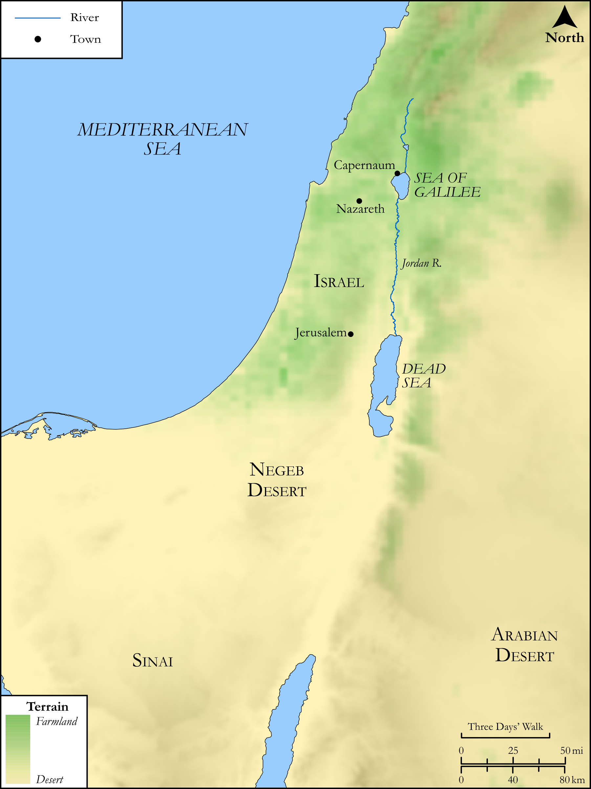

# Biblica Open Bible Maps

## License Information

Biblica Open Bible Maps, © 2023–2025 Biblica, Inc. This work is licensed under Creative Commons Attribution-ShareAlike 4.0 International (https://creativecommons.org/licenses/by-sa/4.0/). More Information: https://docs.google.com/document/d/1Pp44yZ0Zdnd59vJHTrt2rPYq0SppfX5rZbPBt6mz37U/edit?tab=t.0#heading=h.oev9aj1ksvk2

--------------------------------

## SRV Luke: Luke 12:49–58 (id: NT223)

### Image Content

[link](images/NT223.png)

Original: [SRV Luke: Luke 12:49\-58](https://drive.google.com/open?id=1kEpSeuCXU8Ey7ajUoKaWTsozFbroe8GR&usp=drive_copy)

* **Associated Passages:** Luke 12:1-59

* **Associated ACAI Concepts:** LORD (ID: `deity:Lord`); Fear (ID: `keyterm:Fear`); Happy (ID: `keyterm:Happy`); Life (ID: `keyterm:Life`); Ability (ID: `keyterm:Ability`); Body (ID: `keyterm:Body.3`); An Angel (ID: `deity:Angel`); Kingdom (ID: `keyterm:Kingdom`); Parable (ID: `keyterm:Parable`); Holy Spirit (ID: `deity:HolySpirit`); Sky (ID: `keyterm:Heaven`); Heart (ID: `keyterm:Heart`); Be a Disciple (ID: `keyterm:Disciple`); Authority (ID: `keyterm:Authority.2`); Gehenna (ID: `keyterm:Gehenna`); Hypocrisy (ID: `keyterm:Hypocrisy`); Blaspheme (ID: `keyterm:Blaspheme`); Barn (ID: `realia:Barn`); Surely! (ID: `keyterm:Surely`); Baptism (ID: `keyterm:Baptism`); Having Little Faith (ID: `keyterm:HavingLittleFaith`); Glory (ID: `keyterm:Glory`); Proclaim (ID: `keyterm:Proclaim`); Interpret (ID: `keyterm:Interpret`); Pharisees (ID: `group:Pharisee`); Make Peace (ID: `keyterm:Peace`); Faithfulness (ID: `keyterm:Faithfulness`); Bring In (ID: `keyterm:BringIn`); Set Free (ID: `keyterm:SetFree`); Solomon (ID: `person:Solomon`)
