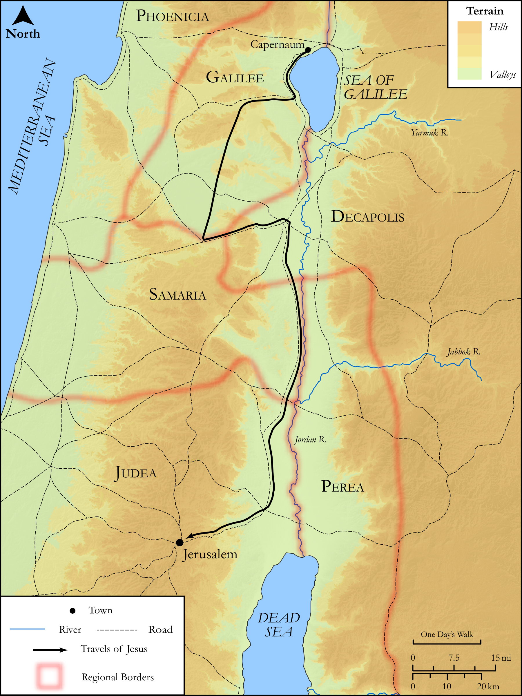

# Biblica Open Bible Maps

## License Information

Biblica Open Bible Maps, © 2023–2025 Biblica, Inc. This work is licensed under Creative Commons Attribution-ShareAlike 4.0 International (https://creativecommons.org/licenses/by-sa/4.0/). More Information: https://docs.google.com/document/d/1Pp44yZ0Zdnd59vJHTrt2rPYq0SppfX5rZbPBt6mz37U/edit?tab=t.0#heading=h.oev9aj1ksvk2

--------------------------------

## SRV Luke: Luke 17:11–18 (id: NT224)

### Image Content

[link](images/NT224.png)

Original: [SRV Luke: Luke 17:11\-18](https://drive.google.com/open?id=1rEqhkeC2F6JgxsvKVDKDbaBgcEjqJKOc&usp=drive_copy)

* **Associated Passages:** Luke 17:1-37

* **Associated ACAI Concepts:** LORD (ID: `deity:Lord`); Jesus (ID: `person:Jesus.2`); Lot (ID: `person:Lot`); Believe (ID: `keyterm:Believe`); Kingdom (ID: `keyterm:Kingdom`); Forgive (ID: `keyterm:Forgive`); Glory (ID: `keyterm:Glory`); Samaria (ID: `place:Samaria`); Repent (ID: `keyterm:Repent`); Be a Disciple (ID: `keyterm:Disciple`); Noah (ID: `person:Noah`); Sky (ID: `keyterm:Heaven`); To Cleanse (ID: `keyterm:Cleanse.2`); To Sin (ID: `keyterm:Sin`); Stumbling Block (ID: `keyterm:StumblingBlock`); Cause to Stumble (ID: `keyterm:CauseToStumble`); Obligated (ID: `keyterm:Ought`); A Group of Disciples (ID: `group:GenericDisciples`); Favor (ID: `keyterm:Favor`); Serve (ID: `keyterm:Serve`); Make Alive (ID: `keyterm:Alive`); Mercy (ID: `keyterm:Mercy`); Galilee (ID: `place:Galilee`); Salvation (ID: `keyterm:Salvation`); Samaritans (ID: `group:Samaritan`); Disaster (ID: `keyterm:Disaster`); Body (ID: `keyterm:Body.3`); Pharisees (ID: `group:Pharisee`); Observation (ID: `keyterm:Observation`); To Command (ID: `keyterm:Command`); Life (ID: `keyterm:Life`); Sodom (ID: `place:Sodom`); Jerusalem (ID: `place:Jerusalem`); Reject (ID: `keyterm:Reject`); Mulberry (ID: `flora:Mulberry`); Flock (ID: `fauna:Flock`); Hand-Mill (ID: `realia:Hand-mill`); Grain (ID: `flora:Grain`); Goat (ID: `fauna:Goat`); Sheep (ID: `fauna:Lamb`); Boat (ID: `realia:Boat`); House (ID: `realia:House`); Bed (ID: `realia:Bed`); Housetop (ID: `realia:Housetop`); Mustard (ID: `flora:Mustard`); Vulture (ID: `fauna:Vulture`)
